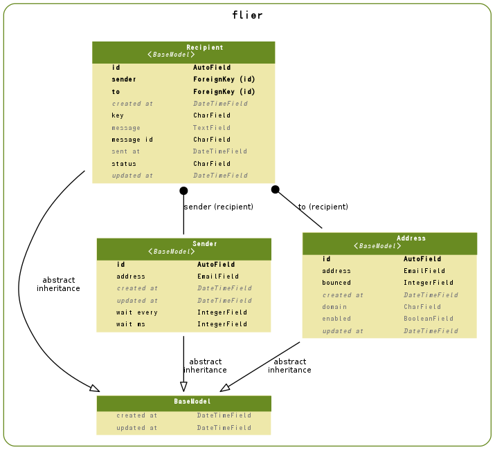

======================
flier Model
======================

.. contents::
    :local:

.. _flier.models.Sender:

Sender:Sender
==========================

.. autoclass:: flier.models.Sender
    :members:

.. list-table::

    *    - id
         - ID
         - integer AUTO_INCREMENT
         - 

    *    - created_at
         - Created At
         - datetime
         - 

    *    - updated_at
         - Updated At
         - datetime
         - 

    *    - address
         - Sender Address
         - varchar(100)
         - 

    *    - wait_every
         - Wait sending for every count
         - integer
         - Wait sending for every count help

    *    - wait_ms
         - Wait milliseconds
         - integer
         - Wait milliseconds help

.. include:: flier.models.Sender.rst

.. _flier.models.Address:

Address:Mail Address
========================================

.. autoclass:: flier.models.Address
    :members:

.. list-table::

    *    - id
         - ID
         - integer AUTO_INCREMENT
         - 

    *    - created_at
         - Created At
         - datetime
         - 

    *    - updated_at
         - Updated At
         - datetime
         - 

    *    - address
         - Email Address
         - varchar(50)
         - Email Address Help

    *    - domain
         - Email Domain
         - varchar(50)
         - Email Domain Help

    *    - bounced
         - Bounced Count
         - integer
         - Bounced Count Help

    *    - enabled
         - Enabled Address
         - bool
         - Enabled Address Help

.. include:: flier.models.Address.rst

.. _flier.models.Recipient:

Recipient:Recipient
======================================

.. autoclass:: flier.models.Recipient
    :members:

.. list-table::

    *    - id
         - ID
         - integer AUTO_INCREMENT
         - 

    *    - created_at
         - Created At
         - datetime
         - 

    *    - updated_at
         - Updated At
         - datetime
         - 

    *    - key
         - Recipient Key
         - varchar(100)
         - Recipient Key

    *    - sender
         - Message Sender
         - integer
         - Message Sender Help

    *    - to
         - Recipient Address
         - integer
         - Recipient Address Help

    *    - message_id
         - Message ID
         - varchar(100)
         - 

    *    - sent_at
         - Sent At to Reipient
         - datetime
         - Sent At to Recipient Help

    *    - status
         - Recipient Status
         - varchar(50)
         - 

    *    - message
         - Recipient Message
         - longtext
         - 

.. include:: flier.models.Recipient.rst

.. _flier.models.er:

ER Diagram
============================

