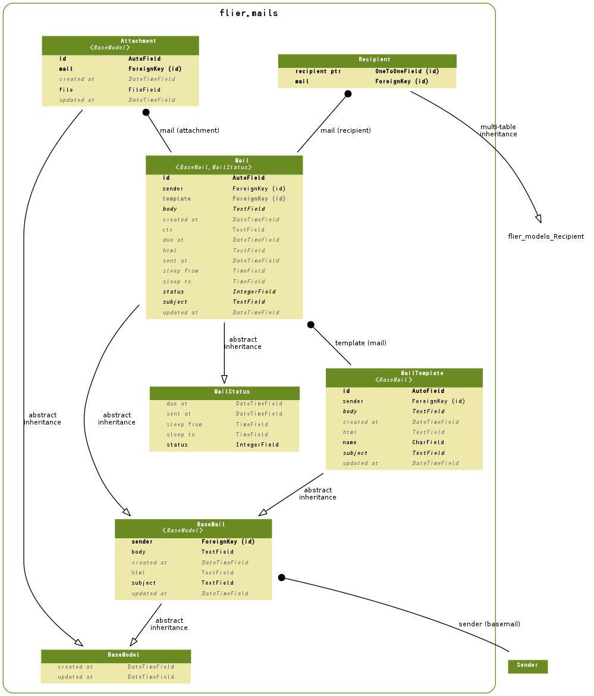

==================================
flier.mails Model
==================================

.. contents::
    :local:

.. _flier.mails.models.MailTemplate:

MailTemplate:Mail Template
====================================================

.. autoclass:: flier.mails.models.MailTemplate
    :members:

.. list-table::

    *    - id
         - ID
         - integer AUTO_INCREMENT
         - 

    *    - created_at
         - Created At
         - datetime
         - 

    *    - updated_at
         - Updated At
         - datetime
         - 

    *    - sender
         - Mail Sender
         - integer
         - Mail Sender Help

    *    - subject
         - Mail Subject
         - longtext
         - Mail Subject Help

    *    - body
         - Mail Body
         - longtext
         - Mail Body Help

    *    - html
         - Mail HTML Body
         - longtext
         - Mail HTML Body Help

    *    - name
         - Mail Name
         - varchar(200)
         - Mail Name Help

.. include:: flier.mails.models.MailTemplate.rst

.. _flier.mails.models.Mail:

Mail:Mail
==================

.. autoclass:: flier.mails.models.Mail
    :members:

.. list-table::

    *    - id
         - ID
         - integer AUTO_INCREMENT
         - 

    *    - created_at
         - Created At
         - datetime
         - 

    *    - updated_at
         - Updated At
         - datetime
         - 

    *    - sender
         - Mail Sender
         - integer
         - Mail Sender Help

    *    - subject
         - Mail Subject
         - longtext
         - Mail Subject Help

    *    - body
         - Mail Body
         - longtext
         - Mail Body Help

    *    - html
         - Mail HTML Body
         - longtext
         - Mail HTML Body Help

    *    - status
         - Mail Status
         - integer
         - Mail Status Help

           .. list-table::

               *    - 0
                    - Disabled Mail
           
               *    - 10
                    - Queued Mail
           
               *    - 20
                    - Sending Mail
           
               *    - 30
                    - Sent Mail
           

    *    - due_at
         - Due At
         - datetime
         - Due At

    *    - sent_at
         - Sent At
         - datetime
         - Sent At Help

    *    - sleep_from
         - Sleep From
         - time
         - Sleep From Help

    *    - sleep_to
         - Sleep To
         - time
         - Sleep To Help

    *    - template
         - template
         - integer
         - 

    *    - ctx
         - Context Data
         - longtext
         - Context Data Help

.. include:: flier.mails.models.Mail.rst

.. _flier.mails.models.Recipient:

Recipient:Mail Recipient
================================================

.. autoclass:: flier.mails.models.Recipient
    :members:

.. list-table::

    *    - id
         - ID
         - integer AUTO_INCREMENT
         - 

    *    - created_at
         - Created At
         - datetime
         - 

    *    - updated_at
         - Updated At
         - datetime
         - 

    *    - key
         - Recipient Key
         - varchar(100)
         - Recipient Key

    *    - sender
         - Message Sender
         - integer
         - Message Sender Help

    *    - to
         - Recipient Address
         - integer
         - Recipient Address Help

    *    - message_id
         - Message ID
         - varchar(100)
         - 

    *    - sent_at
         - Sent At to Reipient
         - datetime
         - Sent At to Recipient Help

    *    - status
         - Recipient Status
         - varchar(50)
         - 

    *    - message
         - Recipient Message
         - longtext
         - 

    *    - recipient_ptr
         - recipient ptr
         - integer
         - 

    *    - mail
         - mail
         - integer
         - 

.. include:: flier.mails.models.Recipient.rst

.. _flier.mails.models.Attachment:

Attachment:Attachment
==========================================

.. autoclass:: flier.mails.models.Attachment
    :members:

.. list-table::

    *    - id
         - ID
         - integer AUTO_INCREMENT
         - 

    *    - created_at
         - Created At
         - datetime
         - 

    *    - updated_at
         - Updated At
         - datetime
         - 

    *    - mail
         - Mail
         - integer
         - Mail Help

    *    - file
         - Attachment File
         - varchar(100)
         - Attrachment File Help

.. include:: flier.mails.models.Attachment.rst

.. _mails.models.er:

ER Diagram
============================

