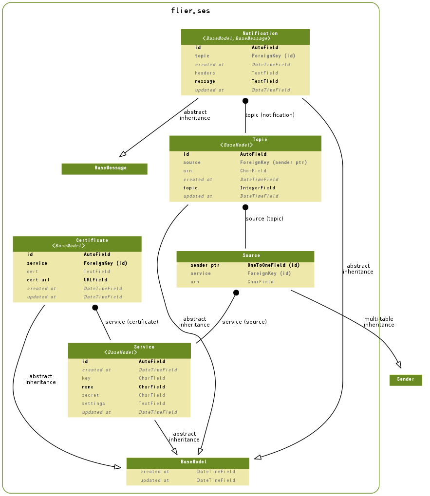

==============================
flier.ses Model
==============================

.. contents::
    :local:

.. _flier.ses.models.Service:

Service:SES Service
======================================

.. autoclass:: flier.ses.models.Service
    :members:

.. list-table::

    *    - id
         - ID
         - integer AUTO_INCREMENT
         - 

    *    - created_at
         - Created At
         - datetime
         - 

    *    - updated_at
         - Updated At
         - datetime
         - 

    *    - name
         - Service Name
         - varchar(100)
         - 

    *    - key
         - SES Access Key
         - varchar(100)
         - 

    *    - secret
         - SES Access Secret
         - varchar(100)
         - 

    *    - settings
         - Settings
         - longtext
         - 

.. include:: flier.ses.models.Service.rst

.. _flier.ses.models.Source:

Source:SES Source
==================================

.. autoclass:: flier.ses.models.Source
    :members:

.. list-table::

    *    - id
         - ID
         - integer AUTO_INCREMENT
         - 

    *    - created_at
         - Created At
         - datetime
         - 

    *    - updated_at
         - Updated At
         - datetime
         - 

    *    - address
         - Sender Address
         - varchar(100)
         - 

    *    - wait_every
         - Wait sending for every count
         - integer
         - Wait sending for every count help

    *    - wait_ms
         - Wait milliseconds
         - integer
         - Wait milliseconds help

    *    - sender_ptr
         - sender ptr
         - integer
         - 

    *    - service
         - service
         - integer
         - 

    *    - arn
         - Source Identity Arn
         - varchar(100)
         - Source Identity Arn

.. include:: flier.ses.models.Source.rst

.. _flier.ses.models.Topic:

Topic:SNS Topic
==============================

.. autoclass:: flier.ses.models.Topic
    :members:

.. list-table::

    *    - id
         - ID
         - integer AUTO_INCREMENT
         - 

    *    - created_at
         - Created At
         - datetime
         - 

    *    - updated_at
         - Updated At
         - datetime
         - 

    *    - source
         - source
         - integer
         - 

    *    - topic
         - Topic
         - integer
         - 

           .. list-table::

               *    - 0
                    - Bounce Topic
           
               *    - 1
                    - Complaint Topic
           
               *    - 2
                    - Delivery Topic
           

    *    - arn
         - Topic Arn
         - varchar(100)
         - 

.. include:: flier.ses.models.Topic.rst

.. _flier.ses.models.Notification:

Notification:Notification
==================================================

.. autoclass:: flier.ses.models.Notification
    :members:

.. list-table::

    *    - id
         - ID
         - integer AUTO_INCREMENT
         - 

    *    - created_at
         - Created At
         - datetime
         - 

    *    - updated_at
         - Updated At
         - datetime
         - 

    *    - topic
         - topic
         - integer
         - 

    *    - message
         - SNS Message
         - longtext
         - SNS Message

    *    - headers
         - SNS Headers
         - longtext
         - SNS Headers Help

.. include:: flier.ses.models.Notification.rst

.. _flier.ses.models.Certificate:

Certificate:SES Certificate
======================================================

.. autoclass:: flier.ses.models.Certificate
    :members:

.. list-table::

    *    - id
         - ID
         - integer AUTO_INCREMENT
         - 

    *    - created_at
         - Created At
         - datetime
         - 

    *    - updated_at
         - Updated At
         - datetime
         - 

    *    - service
         - service
         - integer
         - 

    *    - cert_url
         - Certificate URL
         - varchar(200)
         - 

    *    - cert
         - Certificate
         - longtext
         - 

.. include:: flier.ses.models.Certificate.rst

.. _ses.models.er:

ER Diagram
============================

