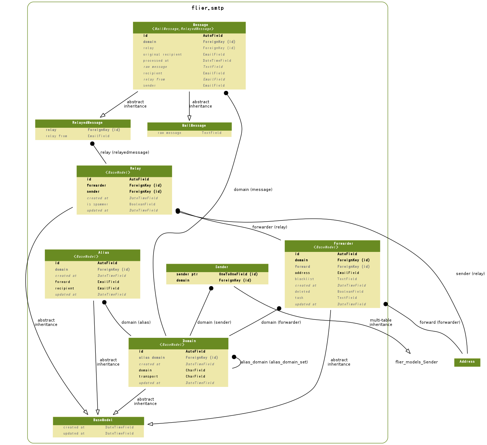

================================
flier.smtp Model
================================

.. contents::
    :local:

.. _flier.smtp.models.Domain:

Domain:Domain
==========================

.. autoclass:: flier.smtp.models.Domain
    :members:

.. list-table::

    *    - id
         - ID
         - integer AUTO_INCREMENT
         - 

    *    - created_at
         - Created At
         - datetime
         - 

    *    - updated_at
         - Updated At
         - datetime
         - 

    *    - domain
         - Domain
         - varchar(50)
         - 

    *    - transport
         - Transport
         - varchar(200)
         - 

    *    - alias_domain
         - Alias Transport
         - integer
         - 

.. include:: flier.smtp.models.Domain.rst

.. _flier.smtp.models.Alias:

Alias:Alias
======================

.. autoclass:: flier.smtp.models.Alias
    :members:

.. list-table::

    *    - id
         - ID
         - integer AUTO_INCREMENT
         - 

    *    - created_at
         - Created At
         - datetime
         - 

    *    - updated_at
         - Updated At
         - datetime
         - 

    *    - domain
         - domain
         - integer
         - 

    *    - recipient
         - Recipient Address
         - varchar(100)
         - 

    *    - forward
         - Forward Address
         - varchar(100)
         - 

.. include:: flier.smtp.models.Alias.rst

.. _flier.smtp.models.Sender:

Sender:Sender
==========================

.. autoclass:: flier.smtp.models.Sender
    :members:

.. list-table::

    *    - id
         - ID
         - integer AUTO_INCREMENT
         - 

    *    - created_at
         - Created At
         - datetime
         - 

    *    - updated_at
         - Updated At
         - datetime
         - 

    *    - address
         - Sender Address
         - varchar(100)
         - 

    *    - wait_every
         - Wait sending for every count
         - integer
         - Wait sending for every count help

    *    - wait_ms
         - Wait milliseconds
         - integer
         - Wait milliseconds help

    *    - sender_ptr
         - sender ptr
         - integer
         - 

    *    - domain
         - Sender Domain
         - integer
         - 

.. include:: flier.smtp.models.Sender.rst

.. _flier.smtp.models.Forwarder:

Forwarder:Forwarder
======================================

.. autoclass:: flier.smtp.models.Forwarder
    :members:

.. list-table::

    *    - id
         - ID
         - integer AUTO_INCREMENT
         - 

    *    - created_at
         - Created At
         - datetime
         - 

    *    - updated_at
         - Updated At
         - datetime
         - 

    *    - domain
         - Sending Domain
         - integer
         - 

    *    - address
         - Forwarder Address
         - varchar(50)
         - Forwarder Address Help

    *    - forward
         - Forward Address
         - integer
         - Forward Address Help

    *    - deleted
         - Is Deleted
         - bool
         - Is Deleted Help

    *    - task
         - Forwarder Task
         - longtext
         - Forwarder Task Help

    *    - blacklist
         - Black List Pattern
         - longtext
         - Black List Pattern Help

.. include:: flier.smtp.models.Forwarder.rst

.. _flier.smtp.models.Relay:

Relay:Relay
======================

.. autoclass:: flier.smtp.models.Relay
    :members:

.. list-table::

    *    - id
         - ID
         - integer AUTO_INCREMENT
         - 

    *    - created_at
         - Created At
         - datetime
         - 

    *    - updated_at
         - Updated At
         - datetime
         - 

    *    - forwarder
         - Original Recipient Forwarder
         - integer
         - Original Recipient Forwarder Help

    *    - sender
         - Original Sender Address
         - integer
         - Original Sender Address Help

    *    - is_spammer
         - Is Spammer
         - bool
         - 

.. include:: flier.smtp.models.Relay.rst

.. _flier.smtp.models.Message:

Message:Message
==============================

.. autoclass:: flier.smtp.models.Message
    :members:

.. list-table::

    *    - id
         - ID
         - integer AUTO_INCREMENT
         - 

    *    - raw_message
         - Raw Message Text
         - longtext
         - Raw Message Text Help

    *    - relay
         - Forwarding Relay
         - integer
         - 

    *    - relay_from
         - Relay From
         - varchar(50)
         - 

    *    - domain
         - Recipient Domain
         - integer
         - 

    *    - sender
         - Sender
         - varchar(100)
         - Sender Help

    *    - recipient
         - Recipient
         - varchar(100)
         - Recipient Help

    *    - original_recipient
         - Original Recipient
         - varchar(100)
         - Oringinal Recipient Help

    *    - processed_at
         - Processed At
         - datetime
         - 

.. include:: flier.smtp.models.Message.rst

.. _smtp.models.er:

ER Diagram
============================

