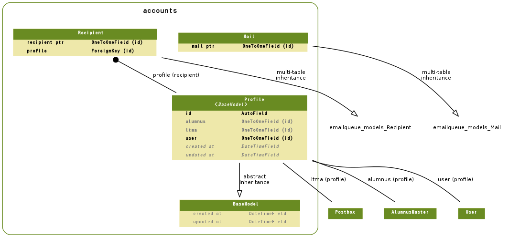

================================================
ユーザー属性関連
================================================

.. contents::
    :local:

.. _accounts.models.BaseModel:

BaseModel:base model
========================================

.. autoclass:: accounts.models.BaseModel
    :members:

.. list-table::

    *    - created_at
         - 作成日時
         - datetime
         - 

    *    - updated_at
         - 更新日時
         - datetime
         - 

.. include:: accounts.models.BaseModel.rst

.. _accounts.models.Mail:

Mail:メール
================

.. autoclass:: accounts.models.Mail
    :members:

.. list-table::

    *    - id
         - ID
         - integer AUTO_INCREMENT
         - 

    *    - created_at
         - 作成日時
         - datetime
         - 

    *    - updated_at
         - 更新日時
         - datetime
         - 

    *    - sender
         - メール送信者
         - integer
         - 送信者

    *    - subject
         - 表題
         - longtext
         - 表題

    *    - body
         - 本文
         - longtext
         - 本文

    *    - html
         - Mail HTML Body
         - longtext
         - Mail HTML Body Help

    *    - status
         - 状態
         - integer
         - 状態

           .. list-table::

               *    - 0
                    - 送信状態:停止
           
               *    - 10
                    - 送信状態:送信待ち
           
               *    - 20
                    - 送信状態:送信中
           
               *    - 30
                    - 送信状態:完了
           

    *    - due_at
         - 送信予定
         - datetime
         - 送信予定

    *    - sent_at
         - 送信日時
         - datetime
         - メールが送信された日時です。記録がないと送信が完了していません。

    *    - sleep_from
         - 停止時間帯:開始
         - time
         - この時間なると送信を一時停止します

    *    - sleep_to
         - 停止時間帯:終了
         - time
         - この時間から送信を再開します

    *    - name
         - メール名称
         - varchar(50)
         - メール名称

    *    - ctx
         - Context Data
         - longtext
         - Context Data Help

    *    - mail_ptr
         - mail ptr
         - integer
         - 

.. include:: accounts.models.Mail.rst

.. _accounts.models.Profile:

Profile:ユーザー属性
============================

.. autoclass:: accounts.models.Profile
    :members:

.. list-table::

    *    - id
         - ID
         - integer AUTO_INCREMENT
         - 

    *    - created_at
         - 作成日時
         - datetime
         - 

    *    - updated_at
         - 更新日時
         - datetime
         - 

    *    - user
         - システムユーザー
         - integer
         - システムユーザー

    *    - ltma
         - LTMA
         - integer
         - 生涯メールアドレス

    *    - alumnus
         - Alumnus
         - integer
         - Web名簿

.. include:: accounts.models.Profile.rst

.. _accounts.models.Recipient:

Recipient:受信者
==========================

.. autoclass:: accounts.models.Recipient
    :members:

.. list-table::

    *    - id
         - ID
         - integer AUTO_INCREMENT
         - 

    *    - created_at
         - 作成日時
         - datetime
         - 

    *    - updated_at
         - 更新日時
         - datetime
         - 

    *    - mail
         - メール
         - integer
         - メール

    *    - to
         - 受信者アドレス
         - integer
         - 受信者アドレス

    *    - return_path
         - 戻りアドレス
         - varchar(50)
         - 戻りアドレス(Return_Path)。ブランクで保存すると自動的に設定されます。

    *    - sent_at
         - 送信日時記録
         - datetime
         - まだ転送されていないと指定されていません。

    *    - error_message
         - エラーメール
         - integer
         - エラーがないと指定されていません。

    *    - recipient_ptr
         - recipient ptr
         - integer
         - 

    *    - profile
         - profile
         - integer
         - 

.. include:: accounts.models.Recipient.rst

.. _accounts.models.er:

ER Diagram
============================

.. _accounts.models.er:

ER Diagram
============================

