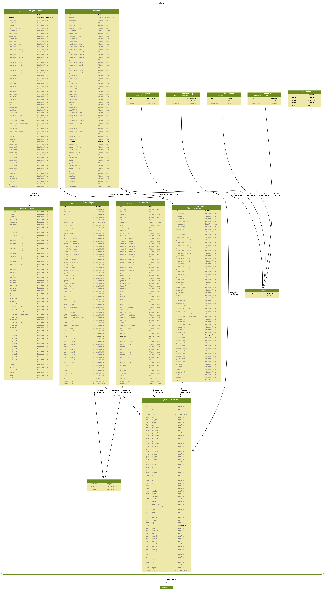

==================
Web名簿
==================

.. contents::
    :local:

.. _alumni.models.AbstractAlumnus:

AbstractAlumnus:abstract alumnus
================================================================

.. autoclass:: alumni.models.AbstractAlumnus
    :members:

.. list-table::

    *    - ordinal
         - 指定並順
         - integer
         - 通常は大きい数値ほど一覧の先頭に現れます。

    *    - created_at
         - 作成日時
         - datetime
         - 

    *    - updated_at
         - 更新日時
         - datetime
         - 

    *    - update_type
         - 更新区分
         - varchar(2)
         - 

    *    - status
         - 会員区分
         - varchar(2)
         - 

           .. list-table::

               *    - 0
                    - 一般
           
               *    - 1
                    - 長寿
           
               *    - 2
                    - 終身
           
               *    - 3
                    - 未入
           
               *    - 4
                    - 死会
           
               *    - 5
                    - 退会
           
               *    - 6
                    - 在外
           
               *    - 7
                    - 死非
           
               *    - 8
                    - 抹消
           
               *    - C
                    - 客員
           
               *    - D
                    - 募金
           
               *    - E
                    - 客死
           
               *    - H
                    - 職員
           
               *    - I
                    - 特別
           
               *    - Z
                    - 他
           
               *    - J
                    - 如水
           
               *    - R
                    - 送付
           
               *    - S
                    - 学生
           
               *    - Y
                    - 掲載
           
               *    - T
                    - 在学
           
               *    - L
                    - 学終
           
               *    - M
                    - ３２
           
               *    - F
                    - 客退
           
               *    - A
                    - 入予
           
               *    - B
                    - 
           

    *    - js_number
         - 如水会番号
         - varchar(12)
         - 6桁の整数です。

    *    - birthday
         - 生年月日
         - varchar(16)
         - 0の場合があります

    *    - dept_code
         - 学部コード
         - varchar(4)
         - 

    *    - grad_year
         - 卒業年
         - varchar(8)
         - 

    *    - entrance_year
         - 入学年
         - varchar(8)
         - 

    *    - class_reunion
         - クラス会
         - varchar(10)
         - 

    *    - party_code_1
         - 各会1
         - varchar(6)
         - 

    *    - party_code_2
         - 各会2
         - varchar(6)
         - 

    *    - party_code_3
         - 各会3
         - varchar(6)
         - 

    *    - party_code_4
         - 各会4
         - varchar(6)
         - 

    *    - party_code_5
         - 各会5
         - varchar(6)
         - 

    *    - party_code_6
         - 各会6
         - varchar(6)
         - 

    *    - party_code_7
         - 各会7
         - varchar(6)
         - 

    *    - party_code_8
         - 各会8
         - varchar(6)
         - 

    *    - party_code_9
         - 各会9
         - varchar(6)
         - 

    *    - party_code_10
         - 各会10
         - varchar(6)
         - 

    *    - modified_at
         - 事務局修正日
         - varchar(16)
         - 事務局がAS/400システムで修正した日です

    *    - full_name
         - 氏名
         - varchar(44)
         - 

    *    - full_name_kana
         - 指名カナ
         - varchar(44)
         - 

    *    - former_name
         - 旧姓
         - varchar(44)
         - 

    *    - grad_era_name_1
         - 卒年号1
         - varchar(12)
         - 

    *    - grad_era_year_1
         - 卒年度1
         - varchar(4)
         - 

    *    - grad_dept_code_1
         - 卒学部コード1
         - varchar(4)
         - 

    *    - grad_dept_name_1
         - 卒学部名1
         - varchar(12)
         - 

    *    - grad_year_1
         - 卒年度1
         - varchar(8)
         - 

    *    - grad_era_name_2
         - 卒年号2
         - varchar(12)
         - 

    *    - grad_era_year_2
         - 卒年度2
         - varchar(4)
         - 

    *    - grad_dept_code_2
         - 卒学部コード2
         - varchar(4)
         - 

    *    - grad_dept_name_2
         - 卒学部名2
         - varchar(12)
         - 

    *    - grad_year_2
         - 卒年度2
         - varchar(8)
         - 

    *    - grad_era_name_3
         - 卒年号3
         - varchar(12)
         - 

    *    - grad_era_year_3
         - 卒年度3
         - varchar(4)
         - 

    *    - grad_dept_code_3
         - 卒学部コード3
         - varchar(4)
         - 

    *    - grad_dept_name_3
         - 卒学部名3
         - varchar(12)
         - 

    *    - grad_year_3
         - 卒年度3
         - varchar(8)
         - 

    *    - office_name_kana
         - 勤務先名カナ
         - varchar(124)
         - 

    *    - office_name
         - 勤務先名称
         - varchar(156)
         - 

    *    - office_title
         - 役職
         - varchar(36)
         - 

    *    - office_division
         - 部署
         - varchar(156)
         - 

    *    - offie_zip
         - 勤務先郵便番号
         - varchar(20)
         - 

    *    - office_address
         - 勤務先住所
         - varchar(252)
         - 

    *    - office_phone
         - 勤務先電話番号
         - varchar(40)
         - 

    *    - office_enrollment_kana
         - 在籍カナ名称
         - varchar(124)
         - 

    *    - office_enrollment
         - 在籍名称
         - varchar(156)
         - 

    *    - home_zip
         - 自宅郵便番号
         - varchar(20)
         - 

    *    - home_address
         - 自宅重祚
         - varchar(252)
         - 

    *    - home_phone
         - 自宅電話番号
         - varchar(40)
         - 

    *    - seminar_1
         - ゼミ1
         - varchar(52)
         - 

    *    - seminar_2
         - ゼミ2
         - varchar(52)
         - 

    *    - circle_1
         - サークル1
         - varchar(52)
         - 

    *    - circle_2
         - サークル2
         - varchar(52)
         - 

    *    - kakin
         - 課金
         - varchar(2)
         - 

           .. list-table::

               *    - 1
                    - Fee is paid
           
               *    - None
                    - Fee is not paid
           

    *    - home_fax
         - 自宅 FAX
         - varchar(40)
         - 

    *    - pc_email
         - 電子メール
         - varchar(108)
         - 

    *    - mobile_email
         - 携帯メールアドレス
         - varchar(108)
         - 

    *    - office_fax
         - 勤務先FAX
         - varchar(40)
         - 

    *    - office_email
         - 勤務先メールアドレス
         - varchar(108)
         - 

    *    - privacy
         - WEB掲載区分
         - varchar(1)
         - 

           .. list-table::

               *    - 0
                    - 公開(0)
           
               *    - 1
                    - 非公開(1)
           
               *    - 2
                    - 一部非公開(2)
           
               *    - 
                    - 公開()
           
               *    - *
                    - 非公開(*)
           

    *    - md5
         - md5
         - varchar(128)
         - 

.. include:: alumni.models.AbstractAlumnus.rst

.. _alumni.models.AbstractAlumnusPrivacy:

AbstractAlumnusPrivacy:abstract alumnus privacy
==============================================================================================

.. autoclass:: alumni.models.AbstractAlumnusPrivacy
    :members:

.. list-table::

    *    - ordinal
         - 指定並順
         - bool
         - 

    *    - created_at
         - 作成日時
         - bool
         - 

    *    - updated_at
         - 更新日時
         - bool
         - 

    *    - update_type
         - 更新区分
         - bool
         - 

    *    - status
         - 会員区分
         - bool
         - 

    *    - js_number
         - 如水会番号
         - bool
         - 

    *    - birthday
         - 生年月日
         - bool
         - 

    *    - dept_code
         - 学部コード
         - bool
         - 

    *    - grad_year
         - 卒業年
         - bool
         - 

    *    - entrance_year
         - 入学年
         - bool
         - 

    *    - class_reunion
         - クラス会
         - bool
         - 

    *    - party_code_1
         - 各会1
         - bool
         - 

    *    - party_code_2
         - 各会2
         - bool
         - 

    *    - party_code_3
         - 各会3
         - bool
         - 

    *    - party_code_4
         - 各会4
         - bool
         - 

    *    - party_code_5
         - 各会5
         - bool
         - 

    *    - party_code_6
         - 各会6
         - bool
         - 

    *    - party_code_7
         - 各会7
         - bool
         - 

    *    - party_code_8
         - 各会8
         - bool
         - 

    *    - party_code_9
         - 各会9
         - bool
         - 

    *    - party_code_10
         - 各会10
         - bool
         - 

    *    - modified_at
         - 事務局修正日
         - bool
         - 

    *    - full_name
         - 氏名
         - bool
         - 

    *    - full_name_kana
         - 指名カナ
         - bool
         - 

    *    - former_name
         - 旧姓
         - bool
         - 

    *    - grad_era_name_1
         - 卒年号1
         - bool
         - 

    *    - grad_era_year_1
         - 卒年度1
         - bool
         - 

    *    - grad_dept_code_1
         - 卒学部コード1
         - bool
         - 

    *    - grad_dept_name_1
         - 卒学部名1
         - bool
         - 

    *    - grad_year_1
         - 卒年度1
         - bool
         - 

    *    - grad_era_name_2
         - 卒年号2
         - bool
         - 

    *    - grad_era_year_2
         - 卒年度2
         - bool
         - 

    *    - grad_dept_code_2
         - 卒学部コード2
         - bool
         - 

    *    - grad_dept_name_2
         - 卒学部名2
         - bool
         - 

    *    - grad_year_2
         - 卒年度2
         - bool
         - 

    *    - grad_era_name_3
         - 卒年号3
         - bool
         - 

    *    - grad_era_year_3
         - 卒年度3
         - bool
         - 

    *    - grad_dept_code_3
         - 卒学部コード3
         - bool
         - 

    *    - grad_dept_name_3
         - 卒学部名3
         - bool
         - 

    *    - grad_year_3
         - 卒年度3
         - bool
         - 

    *    - office_name_kana
         - 勤務先名カナ
         - bool
         - 

    *    - office_name
         - 勤務先名称
         - bool
         - 

    *    - office_title
         - 役職
         - bool
         - 

    *    - office_division
         - 部署
         - bool
         - 

    *    - offie_zip
         - 勤務先郵便番号
         - bool
         - 

    *    - office_address
         - 勤務先住所
         - bool
         - 

    *    - office_phone
         - 勤務先電話番号
         - bool
         - 

    *    - office_enrollment_kana
         - 在籍カナ名称
         - bool
         - 

    *    - office_enrollment
         - 在籍名称
         - bool
         - 

    *    - home_zip
         - 自宅郵便番号
         - bool
         - 

    *    - home_address
         - 自宅重祚
         - bool
         - 

    *    - home_phone
         - 自宅電話番号
         - bool
         - 

    *    - seminar_1
         - ゼミ1
         - bool
         - 

    *    - seminar_2
         - ゼミ2
         - bool
         - 

    *    - circle_1
         - サークル1
         - bool
         - 

    *    - circle_2
         - サークル2
         - bool
         - 

    *    - kakin
         - 課金
         - bool
         - 

    *    - home_fax
         - 自宅 FAX
         - bool
         - 

    *    - pc_email
         - 電子メール
         - bool
         - 

    *    - mobile_email
         - 携帯メールアドレス
         - bool
         - 

    *    - office_fax
         - 勤務先FAX
         - bool
         - 

    *    - office_email
         - 勤務先メールアドレス
         - bool
         - 

    *    - privacy
         - WEB掲載区分
         - bool
         - 

    *    - md5
         - md5
         - bool
         - 

.. include:: alumni.models.AbstractAlumnusPrivacy.rst

.. _alumni.models.AbstractOffice:

AbstractOffice:abstract office
============================================================

.. autoclass:: alumni.models.AbstractOffice
    :members:

.. list-table::

    *    - name
         - 勤務先名称
         - varchar(255)
         - 

    *    - name_kana
         - 勤務先名カナ
         - varchar(255)
         - 

.. include:: alumni.models.AbstractOffice.rst

.. _alumni.models.AlumnusHistory:

AlumnusHistory:名簿(履歴)
==========================================

.. autoclass:: alumni.models.AlumnusHistory
    :members:

.. list-table::

    *    - id
         - ID
         - integer AUTO_INCREMENT
         - 

    *    - ordinal
         - 指定並順
         - integer
         - 通常は大きい数値ほど一覧の先頭に現れます。

    *    - created_at
         - 作成日時
         - datetime
         - 

    *    - updated_at
         - 更新日時
         - datetime
         - 

    *    - title
         - タイトル
         - varchar(50)
         - 更新処理のタイトル

    *    - action
         - 操作
         - integer
         - データ処理

           .. list-table::

               *    - 0
                    - 未定
           
               *    - 1
                    - 更新
           
               *    - 2
                    - 追加
           
               *    - 3
                    - 削除
           
               *    - 4
                    - 何もしない
           

    *    - errors
         - エラー
         - longtext
         - Errors Help

    *    - update_type
         - 更新区分
         - varchar(2)
         - 

    *    - status
         - 会員区分
         - varchar(2)
         - 

           .. list-table::

               *    - 0
                    - 一般
           
               *    - 1
                    - 長寿
           
               *    - 2
                    - 終身
           
               *    - 3
                    - 未入
           
               *    - 4
                    - 死会
           
               *    - 5
                    - 退会
           
               *    - 6
                    - 在外
           
               *    - 7
                    - 死非
           
               *    - 8
                    - 抹消
           
               *    - C
                    - 客員
           
               *    - D
                    - 募金
           
               *    - E
                    - 客死
           
               *    - H
                    - 職員
           
               *    - I
                    - 特別
           
               *    - Z
                    - 他
           
               *    - J
                    - 如水
           
               *    - R
                    - 送付
           
               *    - S
                    - 学生
           
               *    - Y
                    - 掲載
           
               *    - T
                    - 在学
           
               *    - L
                    - 学終
           
               *    - M
                    - ３２
           
               *    - F
                    - 客退
           
               *    - A
                    - 入予
           
               *    - B
                    - 
           

    *    - js_number
         - 如水会番号
         - varchar(12)
         - 6桁の整数です。

    *    - birthday
         - 生年月日
         - varchar(16)
         - 0の場合があります

    *    - dept_code
         - 学部コード
         - varchar(4)
         - 

    *    - grad_year
         - 卒業年
         - varchar(8)
         - 

    *    - entrance_year
         - 入学年
         - varchar(8)
         - 

    *    - class_reunion
         - クラス会
         - varchar(10)
         - 

    *    - party_code_1
         - 各会1
         - varchar(6)
         - 

    *    - party_code_2
         - 各会2
         - varchar(6)
         - 

    *    - party_code_3
         - 各会3
         - varchar(6)
         - 

    *    - party_code_4
         - 各会4
         - varchar(6)
         - 

    *    - party_code_5
         - 各会5
         - varchar(6)
         - 

    *    - party_code_6
         - 各会6
         - varchar(6)
         - 

    *    - party_code_7
         - 各会7
         - varchar(6)
         - 

    *    - party_code_8
         - 各会8
         - varchar(6)
         - 

    *    - party_code_9
         - 各会9
         - varchar(6)
         - 

    *    - party_code_10
         - 各会10
         - varchar(6)
         - 

    *    - modified_at
         - 事務局修正日
         - varchar(16)
         - 事務局がAS/400システムで修正した日です

    *    - full_name
         - 氏名
         - varchar(44)
         - 

    *    - full_name_kana
         - 指名カナ
         - varchar(44)
         - 

    *    - former_name
         - 旧姓
         - varchar(44)
         - 

    *    - grad_era_name_1
         - 卒年号1
         - varchar(12)
         - 

    *    - grad_era_year_1
         - 卒年度1
         - varchar(4)
         - 

    *    - grad_dept_code_1
         - 卒学部コード1
         - varchar(4)
         - 

    *    - grad_dept_name_1
         - 卒学部名1
         - varchar(12)
         - 

    *    - grad_year_1
         - 卒年度1
         - varchar(8)
         - 

    *    - grad_era_name_2
         - 卒年号2
         - varchar(12)
         - 

    *    - grad_era_year_2
         - 卒年度2
         - varchar(4)
         - 

    *    - grad_dept_code_2
         - 卒学部コード2
         - varchar(4)
         - 

    *    - grad_dept_name_2
         - 卒学部名2
         - varchar(12)
         - 

    *    - grad_year_2
         - 卒年度2
         - varchar(8)
         - 

    *    - grad_era_name_3
         - 卒年号3
         - varchar(12)
         - 

    *    - grad_era_year_3
         - 卒年度3
         - varchar(4)
         - 

    *    - grad_dept_code_3
         - 卒学部コード3
         - varchar(4)
         - 

    *    - grad_dept_name_3
         - 卒学部名3
         - varchar(12)
         - 

    *    - grad_year_3
         - 卒年度3
         - varchar(8)
         - 

    *    - office_name_kana
         - 勤務先名カナ
         - varchar(124)
         - 

    *    - office_name
         - 勤務先名称
         - varchar(156)
         - 

    *    - office_title
         - 役職
         - varchar(36)
         - 

    *    - office_division
         - 部署
         - varchar(156)
         - 

    *    - offie_zip
         - 勤務先郵便番号
         - varchar(20)
         - 

    *    - office_address
         - 勤務先住所
         - varchar(252)
         - 

    *    - office_phone
         - 勤務先電話番号
         - varchar(40)
         - 

    *    - office_enrollment_kana
         - 在籍カナ名称
         - varchar(124)
         - 

    *    - office_enrollment
         - 在籍名称
         - varchar(156)
         - 

    *    - home_zip
         - 自宅郵便番号
         - varchar(20)
         - 

    *    - home_address
         - 自宅重祚
         - varchar(252)
         - 

    *    - home_phone
         - 自宅電話番号
         - varchar(40)
         - 

    *    - seminar_1
         - ゼミ1
         - varchar(52)
         - 

    *    - seminar_2
         - ゼミ2
         - varchar(52)
         - 

    *    - circle_1
         - サークル1
         - varchar(52)
         - 

    *    - circle_2
         - サークル2
         - varchar(52)
         - 

    *    - kakin
         - 課金
         - varchar(2)
         - 

           .. list-table::

               *    - 1
                    - Fee is paid
           
               *    - None
                    - Fee is not paid
           

    *    - home_fax
         - 自宅 FAX
         - varchar(40)
         - 

    *    - pc_email
         - 電子メール
         - varchar(108)
         - 

    *    - mobile_email
         - 携帯メールアドレス
         - varchar(108)
         - 

    *    - office_fax
         - 勤務先FAX
         - varchar(40)
         - 

    *    - office_email
         - 勤務先メールアドレス
         - varchar(108)
         - 

    *    - privacy
         - WEB掲載区分
         - varchar(1)
         - 

           .. list-table::

               *    - 0
                    - 公開(0)
           
               *    - 1
                    - 非公開(1)
           
               *    - 2
                    - 一部非公開(2)
           
               *    - 
                    - 公開()
           
               *    - *
                    - 非公開(*)
           

    *    - md5
         - md5
         - varchar(128)
         - 

.. include:: alumni.models.AlumnusHistory.rst

.. _alumni.models.AlumnusImport:

AlumnusImport:名簿(インポート)
==============================================

.. autoclass:: alumni.models.AlumnusImport
    :members:

.. list-table::

    *    - id
         - ID
         - integer AUTO_INCREMENT
         - 

    *    - ordinal
         - 指定並順
         - integer
         - 通常は大きい数値ほど一覧の先頭に現れます。

    *    - created_at
         - 作成日時
         - datetime
         - 

    *    - updated_at
         - 更新日時
         - datetime
         - 

    *    - title
         - タイトル
         - varchar(50)
         - 更新処理のタイトル

    *    - action
         - 操作
         - integer
         - データ処理

           .. list-table::

               *    - 0
                    - 未定
           
               *    - 1
                    - 更新
           
               *    - 2
                    - 追加
           
               *    - 3
                    - 削除
           
               *    - 4
                    - 何もしない
           

    *    - errors
         - エラー
         - longtext
         - Errors Help

    *    - update_type
         - 更新区分
         - varchar(2)
         - 

    *    - status
         - 会員区分
         - varchar(2)
         - 

           .. list-table::

               *    - 0
                    - 一般
           
               *    - 1
                    - 長寿
           
               *    - 2
                    - 終身
           
               *    - 3
                    - 未入
           
               *    - 4
                    - 死会
           
               *    - 5
                    - 退会
           
               *    - 6
                    - 在外
           
               *    - 7
                    - 死非
           
               *    - 8
                    - 抹消
           
               *    - C
                    - 客員
           
               *    - D
                    - 募金
           
               *    - E
                    - 客死
           
               *    - H
                    - 職員
           
               *    - I
                    - 特別
           
               *    - Z
                    - 他
           
               *    - J
                    - 如水
           
               *    - R
                    - 送付
           
               *    - S
                    - 学生
           
               *    - Y
                    - 掲載
           
               *    - T
                    - 在学
           
               *    - L
                    - 学終
           
               *    - M
                    - ３２
           
               *    - F
                    - 客退
           
               *    - A
                    - 入予
           
               *    - B
                    - 
           

    *    - js_number
         - 如水会番号
         - varchar(12)
         - 6桁の整数です。

    *    - birthday
         - 生年月日
         - varchar(16)
         - 0の場合があります

    *    - dept_code
         - 学部コード
         - varchar(4)
         - 

    *    - grad_year
         - 卒業年
         - varchar(8)
         - 

    *    - entrance_year
         - 入学年
         - varchar(8)
         - 

    *    - class_reunion
         - クラス会
         - varchar(10)
         - 

    *    - party_code_1
         - 各会1
         - varchar(6)
         - 

    *    - party_code_2
         - 各会2
         - varchar(6)
         - 

    *    - party_code_3
         - 各会3
         - varchar(6)
         - 

    *    - party_code_4
         - 各会4
         - varchar(6)
         - 

    *    - party_code_5
         - 各会5
         - varchar(6)
         - 

    *    - party_code_6
         - 各会6
         - varchar(6)
         - 

    *    - party_code_7
         - 各会7
         - varchar(6)
         - 

    *    - party_code_8
         - 各会8
         - varchar(6)
         - 

    *    - party_code_9
         - 各会9
         - varchar(6)
         - 

    *    - party_code_10
         - 各会10
         - varchar(6)
         - 

    *    - modified_at
         - 事務局修正日
         - varchar(16)
         - 事務局がAS/400システムで修正した日です

    *    - full_name
         - 氏名
         - varchar(44)
         - 

    *    - full_name_kana
         - 指名カナ
         - varchar(44)
         - 

    *    - former_name
         - 旧姓
         - varchar(44)
         - 

    *    - grad_era_name_1
         - 卒年号1
         - varchar(12)
         - 

    *    - grad_era_year_1
         - 卒年度1
         - varchar(4)
         - 

    *    - grad_dept_code_1
         - 卒学部コード1
         - varchar(4)
         - 

    *    - grad_dept_name_1
         - 卒学部名1
         - varchar(12)
         - 

    *    - grad_year_1
         - 卒年度1
         - varchar(8)
         - 

    *    - grad_era_name_2
         - 卒年号2
         - varchar(12)
         - 

    *    - grad_era_year_2
         - 卒年度2
         - varchar(4)
         - 

    *    - grad_dept_code_2
         - 卒学部コード2
         - varchar(4)
         - 

    *    - grad_dept_name_2
         - 卒学部名2
         - varchar(12)
         - 

    *    - grad_year_2
         - 卒年度2
         - varchar(8)
         - 

    *    - grad_era_name_3
         - 卒年号3
         - varchar(12)
         - 

    *    - grad_era_year_3
         - 卒年度3
         - varchar(4)
         - 

    *    - grad_dept_code_3
         - 卒学部コード3
         - varchar(4)
         - 

    *    - grad_dept_name_3
         - 卒学部名3
         - varchar(12)
         - 

    *    - grad_year_3
         - 卒年度3
         - varchar(8)
         - 

    *    - office_name_kana
         - 勤務先名カナ
         - varchar(124)
         - 

    *    - office_name
         - 勤務先名称
         - varchar(156)
         - 

    *    - office_title
         - 役職
         - varchar(36)
         - 

    *    - office_division
         - 部署
         - varchar(156)
         - 

    *    - offie_zip
         - 勤務先郵便番号
         - varchar(20)
         - 

    *    - office_address
         - 勤務先住所
         - varchar(252)
         - 

    *    - office_phone
         - 勤務先電話番号
         - varchar(40)
         - 

    *    - office_enrollment_kana
         - 在籍カナ名称
         - varchar(124)
         - 

    *    - office_enrollment
         - 在籍名称
         - varchar(156)
         - 

    *    - home_zip
         - 自宅郵便番号
         - varchar(20)
         - 

    *    - home_address
         - 自宅重祚
         - varchar(252)
         - 

    *    - home_phone
         - 自宅電話番号
         - varchar(40)
         - 

    *    - seminar_1
         - ゼミ1
         - varchar(52)
         - 

    *    - seminar_2
         - ゼミ2
         - varchar(52)
         - 

    *    - circle_1
         - サークル1
         - varchar(52)
         - 

    *    - circle_2
         - サークル2
         - varchar(52)
         - 

    *    - kakin
         - 課金
         - varchar(2)
         - 

           .. list-table::

               *    - 1
                    - Fee is paid
           
               *    - None
                    - Fee is not paid
           

    *    - home_fax
         - 自宅 FAX
         - varchar(40)
         - 

    *    - pc_email
         - 電子メール
         - varchar(108)
         - 

    *    - mobile_email
         - 携帯メールアドレス
         - varchar(108)
         - 

    *    - office_fax
         - 勤務先FAX
         - varchar(40)
         - 

    *    - office_email
         - 勤務先メールアドレス
         - varchar(108)
         - 

    *    - privacy
         - WEB掲載区分
         - varchar(1)
         - 

           .. list-table::

               *    - 0
                    - 公開(0)
           
               *    - 1
                    - 非公開(1)
           
               *    - 2
                    - 一部非公開(2)
           
               *    - 
                    - 公開()
           
               *    - *
                    - 非公開(*)
           

    *    - md5
         - md5
         - varchar(128)
         - 

.. include:: alumni.models.AlumnusImport.rst

.. _alumni.models.AlumnusMaster:

AlumnusMaster:名簿
================================

.. autoclass:: alumni.models.AlumnusMaster
    :members:

.. list-table::

    *    - id
         - ID
         - integer AUTO_INCREMENT
         - 

    *    - ordinal
         - 指定並順
         - integer
         - 通常は大きい数値ほど一覧の先頭に現れます。

    *    - created_at
         - 作成日時
         - datetime
         - 

    *    - updated_at
         - 更新日時
         - datetime
         - 

    *    - update_type
         - 更新区分
         - varchar(2)
         - 

    *    - status
         - 会員区分
         - varchar(2)
         - 

           .. list-table::

               *    - 0
                    - 一般
           
               *    - 1
                    - 長寿
           
               *    - 2
                    - 終身
           
               *    - 3
                    - 未入
           
               *    - 4
                    - 死会
           
               *    - 5
                    - 退会
           
               *    - 6
                    - 在外
           
               *    - 7
                    - 死非
           
               *    - 8
                    - 抹消
           
               *    - C
                    - 客員
           
               *    - D
                    - 募金
           
               *    - E
                    - 客死
           
               *    - H
                    - 職員
           
               *    - I
                    - 特別
           
               *    - Z
                    - 他
           
               *    - J
                    - 如水
           
               *    - R
                    - 送付
           
               *    - S
                    - 学生
           
               *    - Y
                    - 掲載
           
               *    - T
                    - 在学
           
               *    - L
                    - 学終
           
               *    - M
                    - ３２
           
               *    - F
                    - 客退
           
               *    - A
                    - 入予
           
               *    - B
                    - 
           

    *    - js_number
         - 如水会番号
         - varchar(12)
         - 6桁の整数です。

    *    - birthday
         - 生年月日
         - varchar(16)
         - 0の場合があります

    *    - dept_code
         - 学部コード
         - varchar(4)
         - 

    *    - grad_year
         - 卒業年
         - varchar(8)
         - 

    *    - entrance_year
         - 入学年
         - varchar(8)
         - 

    *    - class_reunion
         - クラス会
         - varchar(10)
         - 

    *    - party_code_1
         - 各会1
         - varchar(6)
         - 

    *    - party_code_2
         - 各会2
         - varchar(6)
         - 

    *    - party_code_3
         - 各会3
         - varchar(6)
         - 

    *    - party_code_4
         - 各会4
         - varchar(6)
         - 

    *    - party_code_5
         - 各会5
         - varchar(6)
         - 

    *    - party_code_6
         - 各会6
         - varchar(6)
         - 

    *    - party_code_7
         - 各会7
         - varchar(6)
         - 

    *    - party_code_8
         - 各会8
         - varchar(6)
         - 

    *    - party_code_9
         - 各会9
         - varchar(6)
         - 

    *    - party_code_10
         - 各会10
         - varchar(6)
         - 

    *    - modified_at
         - 事務局修正日
         - varchar(16)
         - 事務局がAS/400システムで修正した日です

    *    - full_name
         - 氏名
         - varchar(44)
         - 

    *    - full_name_kana
         - 指名カナ
         - varchar(44)
         - 

    *    - former_name
         - 旧姓
         - varchar(44)
         - 

    *    - grad_era_name_1
         - 卒年号1
         - varchar(12)
         - 

    *    - grad_era_year_1
         - 卒年度1
         - varchar(4)
         - 

    *    - grad_dept_code_1
         - 卒学部コード1
         - varchar(4)
         - 

    *    - grad_dept_name_1
         - 卒学部名1
         - varchar(12)
         - 

    *    - grad_year_1
         - 卒年度1
         - varchar(8)
         - 

    *    - grad_era_name_2
         - 卒年号2
         - varchar(12)
         - 

    *    - grad_era_year_2
         - 卒年度2
         - varchar(4)
         - 

    *    - grad_dept_code_2
         - 卒学部コード2
         - varchar(4)
         - 

    *    - grad_dept_name_2
         - 卒学部名2
         - varchar(12)
         - 

    *    - grad_year_2
         - 卒年度2
         - varchar(8)
         - 

    *    - grad_era_name_3
         - 卒年号3
         - varchar(12)
         - 

    *    - grad_era_year_3
         - 卒年度3
         - varchar(4)
         - 

    *    - grad_dept_code_3
         - 卒学部コード3
         - varchar(4)
         - 

    *    - grad_dept_name_3
         - 卒学部名3
         - varchar(12)
         - 

    *    - grad_year_3
         - 卒年度3
         - varchar(8)
         - 

    *    - office_name_kana
         - 勤務先名カナ
         - varchar(124)
         - 

    *    - office_name
         - 勤務先名称
         - varchar(156)
         - 

    *    - office_title
         - 役職
         - varchar(36)
         - 

    *    - office_division
         - 部署
         - varchar(156)
         - 

    *    - offie_zip
         - 勤務先郵便番号
         - varchar(20)
         - 

    *    - office_address
         - 勤務先住所
         - varchar(252)
         - 

    *    - office_phone
         - 勤務先電話番号
         - varchar(40)
         - 

    *    - office_enrollment_kana
         - 在籍カナ名称
         - varchar(124)
         - 

    *    - office_enrollment
         - 在籍名称
         - varchar(156)
         - 

    *    - home_zip
         - 自宅郵便番号
         - varchar(20)
         - 

    *    - home_address
         - 自宅重祚
         - varchar(252)
         - 

    *    - home_phone
         - 自宅電話番号
         - varchar(40)
         - 

    *    - seminar_1
         - ゼミ1
         - varchar(52)
         - 

    *    - seminar_2
         - ゼミ2
         - varchar(52)
         - 

    *    - circle_1
         - サークル1
         - varchar(52)
         - 

    *    - circle_2
         - サークル2
         - varchar(52)
         - 

    *    - kakin
         - 課金
         - varchar(2)
         - 

           .. list-table::

               *    - 1
                    - Fee is paid
           
               *    - None
                    - Fee is not paid
           

    *    - home_fax
         - 自宅 FAX
         - varchar(40)
         - 

    *    - pc_email
         - 電子メール
         - varchar(108)
         - 

    *    - mobile_email
         - 携帯メールアドレス
         - varchar(108)
         - 

    *    - office_fax
         - 勤務先FAX
         - varchar(40)
         - 

    *    - office_email
         - 勤務先メールアドレス
         - varchar(108)
         - 

    *    - privacy
         - WEB掲載区分
         - varchar(1)
         - 

           .. list-table::

               *    - 0
                    - 公開(0)
           
               *    - 1
                    - 非公開(1)
           
               *    - 2
                    - 一部非公開(2)
           
               *    - 
                    - 公開()
           
               *    - *
                    - 非公開(*)
           

    *    - md5
         - md5
         - varchar(128)
         - 

.. include:: alumni.models.AlumnusMaster.rst

.. _alumni.models.AlumnusPrivacy:

AlumnusPrivacy:名簿プライバシー設定
==================================================

.. autoclass:: alumni.models.AlumnusPrivacy
    :members:

.. list-table::

    *    - id
         - ID
         - integer AUTO_INCREMENT
         - 

    *    - ordinal
         - 指定並順
         - bool
         - 

    *    - created_at
         - 作成日時
         - bool
         - 

    *    - updated_at
         - 更新日時
         - bool
         - 

    *    - update_type
         - 更新区分
         - bool
         - 

    *    - status
         - 会員区分
         - bool
         - 

    *    - js_number
         - 如水会番号
         - bool
         - 

    *    - birthday
         - 生年月日
         - bool
         - 

    *    - dept_code
         - 学部コード
         - bool
         - 

    *    - grad_year
         - 卒業年
         - bool
         - 

    *    - entrance_year
         - 入学年
         - bool
         - 

    *    - class_reunion
         - クラス会
         - bool
         - 

    *    - party_code_1
         - 各会1
         - bool
         - 

    *    - party_code_2
         - 各会2
         - bool
         - 

    *    - party_code_3
         - 各会3
         - bool
         - 

    *    - party_code_4
         - 各会4
         - bool
         - 

    *    - party_code_5
         - 各会5
         - bool
         - 

    *    - party_code_6
         - 各会6
         - bool
         - 

    *    - party_code_7
         - 各会7
         - bool
         - 

    *    - party_code_8
         - 各会8
         - bool
         - 

    *    - party_code_9
         - 各会9
         - bool
         - 

    *    - party_code_10
         - 各会10
         - bool
         - 

    *    - modified_at
         - 事務局修正日
         - bool
         - 

    *    - full_name
         - 氏名
         - bool
         - 

    *    - full_name_kana
         - 指名カナ
         - bool
         - 

    *    - former_name
         - 旧姓
         - bool
         - 

    *    - grad_era_name_1
         - 卒年号1
         - bool
         - 

    *    - grad_era_year_1
         - 卒年度1
         - bool
         - 

    *    - grad_dept_code_1
         - 卒学部コード1
         - bool
         - 

    *    - grad_dept_name_1
         - 卒学部名1
         - bool
         - 

    *    - grad_year_1
         - 卒年度1
         - bool
         - 

    *    - grad_era_name_2
         - 卒年号2
         - bool
         - 

    *    - grad_era_year_2
         - 卒年度2
         - bool
         - 

    *    - grad_dept_code_2
         - 卒学部コード2
         - bool
         - 

    *    - grad_dept_name_2
         - 卒学部名2
         - bool
         - 

    *    - grad_year_2
         - 卒年度2
         - bool
         - 

    *    - grad_era_name_3
         - 卒年号3
         - bool
         - 

    *    - grad_era_year_3
         - 卒年度3
         - bool
         - 

    *    - grad_dept_code_3
         - 卒学部コード3
         - bool
         - 

    *    - grad_dept_name_3
         - 卒学部名3
         - bool
         - 

    *    - grad_year_3
         - 卒年度3
         - bool
         - 

    *    - office_name_kana
         - 勤務先名カナ
         - bool
         - 

    *    - office_name
         - 勤務先名称
         - bool
         - 

    *    - office_title
         - 役職
         - bool
         - 

    *    - office_division
         - 部署
         - bool
         - 

    *    - offie_zip
         - 勤務先郵便番号
         - bool
         - 

    *    - office_address
         - 勤務先住所
         - bool
         - 

    *    - office_phone
         - 勤務先電話番号
         - bool
         - 

    *    - office_enrollment_kana
         - 在籍カナ名称
         - bool
         - 

    *    - office_enrollment
         - 在籍名称
         - bool
         - 

    *    - home_zip
         - 自宅郵便番号
         - bool
         - 

    *    - home_address
         - 自宅重祚
         - bool
         - 

    *    - home_phone
         - 自宅電話番号
         - bool
         - 

    *    - seminar_1
         - ゼミ1
         - bool
         - 

    *    - seminar_2
         - ゼミ2
         - bool
         - 

    *    - circle_1
         - サークル1
         - bool
         - 

    *    - circle_2
         - サークル2
         - bool
         - 

    *    - kakin
         - 課金
         - bool
         - 

    *    - home_fax
         - 自宅 FAX
         - bool
         - 

    *    - pc_email
         - 電子メール
         - bool
         - 

    *    - mobile_email
         - 携帯メールアドレス
         - bool
         - 

    *    - office_fax
         - 勤務先FAX
         - bool
         - 

    *    - office_email
         - 勤務先メールアドレス
         - bool
         - 

    *    - privacy
         - WEB掲載区分
         - bool
         - 

    *    - md5
         - md5
         - bool
         - 

    *    - master
         - 名簿
         - integer
         - 名簿(管理者向け)

.. include:: alumni.models.AlumnusPrivacy.rst

.. _alumni.models.AlumnusPublic:

AlumnusPublic:名簿(一般)
========================================

.. autoclass:: alumni.models.AlumnusPublic
    :members:

.. list-table::

    *    - id
         - ID
         - integer AUTO_INCREMENT
         - 

    *    - ordinal
         - 指定並順
         - integer
         - 通常は大きい数値ほど一覧の先頭に現れます。

    *    - created_at
         - 作成日時
         - datetime
         - 

    *    - updated_at
         - 更新日時
         - datetime
         - 

    *    - update_type
         - 更新区分
         - varchar(2)
         - 

    *    - status
         - 会員区分
         - varchar(2)
         - 

           .. list-table::

               *    - 0
                    - 一般
           
               *    - 1
                    - 長寿
           
               *    - 2
                    - 終身
           
               *    - 3
                    - 未入
           
               *    - 4
                    - 死会
           
               *    - 5
                    - 退会
           
               *    - 6
                    - 在外
           
               *    - 7
                    - 死非
           
               *    - 8
                    - 抹消
           
               *    - C
                    - 客員
           
               *    - D
                    - 募金
           
               *    - E
                    - 客死
           
               *    - H
                    - 職員
           
               *    - I
                    - 特別
           
               *    - Z
                    - 他
           
               *    - J
                    - 如水
           
               *    - R
                    - 送付
           
               *    - S
                    - 学生
           
               *    - Y
                    - 掲載
           
               *    - T
                    - 在学
           
               *    - L
                    - 学終
           
               *    - M
                    - ３２
           
               *    - F
                    - 客退
           
               *    - A
                    - 入予
           
               *    - B
                    - 
           

    *    - js_number
         - 如水会番号
         - varchar(12)
         - 6桁の整数です。

    *    - birthday
         - 生年月日
         - varchar(16)
         - 0の場合があります

    *    - dept_code
         - 学部コード
         - varchar(4)
         - 

    *    - grad_year
         - 卒業年
         - varchar(8)
         - 

    *    - entrance_year
         - 入学年
         - varchar(8)
         - 

    *    - class_reunion
         - クラス会
         - varchar(10)
         - 

    *    - party_code_1
         - 各会1
         - varchar(6)
         - 

    *    - party_code_2
         - 各会2
         - varchar(6)
         - 

    *    - party_code_3
         - 各会3
         - varchar(6)
         - 

    *    - party_code_4
         - 各会4
         - varchar(6)
         - 

    *    - party_code_5
         - 各会5
         - varchar(6)
         - 

    *    - party_code_6
         - 各会6
         - varchar(6)
         - 

    *    - party_code_7
         - 各会7
         - varchar(6)
         - 

    *    - party_code_8
         - 各会8
         - varchar(6)
         - 

    *    - party_code_9
         - 各会9
         - varchar(6)
         - 

    *    - party_code_10
         - 各会10
         - varchar(6)
         - 

    *    - modified_at
         - 事務局修正日
         - varchar(16)
         - 事務局がAS/400システムで修正した日です

    *    - full_name
         - 氏名
         - varchar(44)
         - 

    *    - full_name_kana
         - 指名カナ
         - varchar(44)
         - 

    *    - former_name
         - 旧姓
         - varchar(44)
         - 

    *    - grad_era_name_1
         - 卒年号1
         - varchar(12)
         - 

    *    - grad_era_year_1
         - 卒年度1
         - varchar(4)
         - 

    *    - grad_dept_code_1
         - 卒学部コード1
         - varchar(4)
         - 

    *    - grad_dept_name_1
         - 卒学部名1
         - varchar(12)
         - 

    *    - grad_year_1
         - 卒年度1
         - varchar(8)
         - 

    *    - grad_era_name_2
         - 卒年号2
         - varchar(12)
         - 

    *    - grad_era_year_2
         - 卒年度2
         - varchar(4)
         - 

    *    - grad_dept_code_2
         - 卒学部コード2
         - varchar(4)
         - 

    *    - grad_dept_name_2
         - 卒学部名2
         - varchar(12)
         - 

    *    - grad_year_2
         - 卒年度2
         - varchar(8)
         - 

    *    - grad_era_name_3
         - 卒年号3
         - varchar(12)
         - 

    *    - grad_era_year_3
         - 卒年度3
         - varchar(4)
         - 

    *    - grad_dept_code_3
         - 卒学部コード3
         - varchar(4)
         - 

    *    - grad_dept_name_3
         - 卒学部名3
         - varchar(12)
         - 

    *    - grad_year_3
         - 卒年度3
         - varchar(8)
         - 

    *    - office_name_kana
         - 勤務先名カナ
         - varchar(124)
         - 

    *    - office_name
         - 勤務先名称
         - varchar(156)
         - 

    *    - office_title
         - 役職
         - varchar(36)
         - 

    *    - office_division
         - 部署
         - varchar(156)
         - 

    *    - offie_zip
         - 勤務先郵便番号
         - varchar(20)
         - 

    *    - office_address
         - 勤務先住所
         - varchar(252)
         - 

    *    - office_phone
         - 勤務先電話番号
         - varchar(40)
         - 

    *    - office_enrollment_kana
         - 在籍カナ名称
         - varchar(124)
         - 

    *    - office_enrollment
         - 在籍名称
         - varchar(156)
         - 

    *    - home_zip
         - 自宅郵便番号
         - varchar(20)
         - 

    *    - home_address
         - 自宅重祚
         - varchar(252)
         - 

    *    - home_phone
         - 自宅電話番号
         - varchar(40)
         - 

    *    - seminar_1
         - ゼミ1
         - varchar(52)
         - 

    *    - seminar_2
         - ゼミ2
         - varchar(52)
         - 

    *    - circle_1
         - サークル1
         - varchar(52)
         - 

    *    - circle_2
         - サークル2
         - varchar(52)
         - 

    *    - kakin
         - 課金
         - varchar(2)
         - 

           .. list-table::

               *    - 1
                    - Fee is paid
           
               *    - None
                    - Fee is not paid
           

    *    - home_fax
         - 自宅 FAX
         - varchar(40)
         - 

    *    - pc_email
         - 電子メール
         - varchar(108)
         - 

    *    - mobile_email
         - 携帯メールアドレス
         - varchar(108)
         - 

    *    - office_fax
         - 勤務先FAX
         - varchar(40)
         - 

    *    - office_email
         - 勤務先メールアドレス
         - varchar(108)
         - 

    *    - privacy
         - WEB掲載区分
         - varchar(1)
         - 

           .. list-table::

               *    - 0
                    - 公開(0)
           
               *    - 1
                    - 非公開(1)
           
               *    - 2
                    - 一部非公開(2)
           
               *    - 
                    - 公開()
           
               *    - *
                    - 非公開(*)
           

    *    - md5
         - md5
         - varchar(128)
         - 

    *    - master
         - 名簿
         - integer
         - 名簿(管理者向け)

.. include:: alumni.models.AlumnusPublic.rst

.. _alumni.models.Department:

Department:学部
==========================

.. autoclass:: alumni.models.Department
    :members:

.. list-table::

    *    - id
         - ID
         - integer AUTO_INCREMENT
         - 

    *    - code
         - 学部コード
         - varchar(2)
         - 

    *    - name
         - 学部名
         - varchar(20)
         - 

    *    - order
         - order
         - integer
         - 

    *    - disp
         - disp
         - integer
         - 

.. include:: alumni.models.Department.rst

.. _alumni.models.OfficeBackup:

OfficeBackup:勤務先(バックアップ)
================================================

.. autoclass:: alumni.models.OfficeBackup
    :members:

.. list-table::

    *    - id
         - ID
         - integer AUTO_INCREMENT
         - 

    *    - name
         - 勤務先名称
         - varchar(255)
         - 

    *    - name_kana
         - 勤務先名カナ
         - varchar(255)
         - 

.. include:: alumni.models.OfficeBackup.rst

.. _alumni.models.OfficeImport:

OfficeImport:勤務先(インポート)
==============================================

.. autoclass:: alumni.models.OfficeImport
    :members:

.. list-table::

    *    - id
         - ID
         - integer AUTO_INCREMENT
         - 

    *    - name
         - 勤務先名称
         - varchar(255)
         - 

    *    - name_kana
         - 勤務先名カナ
         - varchar(255)
         - 

.. include:: alumni.models.OfficeImport.rst

.. _alumni.models.OfficeMaster:

OfficeMaster:勤務先
================================

.. autoclass:: alumni.models.OfficeMaster
    :members:

.. list-table::

    *    - id
         - ID
         - integer AUTO_INCREMENT
         - 

    *    - name
         - 勤務先名称
         - varchar(255)
         - 

    *    - name_kana
         - 勤務先名カナ
         - varchar(255)
         - 

.. include:: alumni.models.OfficeMaster.rst

.. _alumni.models.OfficePublic:

OfficePublic:勤務先(一般)
========================================

.. autoclass:: alumni.models.OfficePublic
    :members:

.. list-table::

    *    - id
         - ID
         - integer AUTO_INCREMENT
         - 

    *    - name
         - 勤務先名称
         - varchar(255)
         - 

    *    - name_kana
         - 勤務先名カナ
         - varchar(255)
         - 

.. include:: alumni.models.OfficePublic.rst

.. _alumni.models.er:

ER Diagram
============================

.. _alumni.models.er:

ER Diagram
============================

