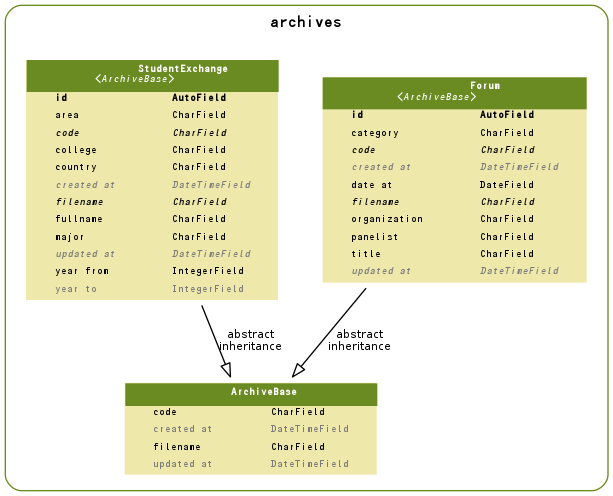

======================================================
アーカイブシステム
======================================================

.. contents::
    :local:

.. _archives.models.ArchiveBase:

ArchiveBase:archive base
================================================

.. autoclass:: archives.models.ArchiveBase
    :members:

.. list-table::

    *    - code
         - Code
         - varchar(20)
         - 

    *    - filename
         - ファイル名
         - varchar(50)
         - 

    *    - created_at
         - 作成日時
         - datetime
         - 

    *    - updated_at
         - 更新日時
         - datetime
         - 

.. include:: archives.models.ArchiveBase.rst

.. _archives.models.Forum:

Forum:一橋フォーラム
==========================

.. autoclass:: archives.models.Forum
    :members:

.. list-table::

    *    - id
         - ID
         - integer AUTO_INCREMENT
         - 

    *    - code
         - Code
         - varchar(20)
         - 

    *    - filename
         - ファイル名
         - varchar(50)
         - 

    *    - created_at
         - 作成日時
         - datetime
         - 

    *    - updated_at
         - 更新日時
         - datetime
         - 

    *    - category
         - カテゴリ
         - varchar(20)
         - カテゴリ

    *    - title
         - タイトル
         - varchar(200)
         - タイトル

    *    - panelist
         - 講師名
         - varchar(100)
         - 講師名

    *    - organization
         - 講師所属
         - varchar(100)
         - 講師所属

    *    - date_at
         - 開催年月日
         - date
         - 開催年月日

.. include:: archives.models.Forum.rst

.. _archives.models.StudentExchange:

StudentExchange:留学生レポート
==============================================

.. autoclass:: archives.models.StudentExchange
    :members:

.. list-table::

    *    - id
         - ID
         - integer AUTO_INCREMENT
         - 

    *    - code
         - Code
         - varchar(20)
         - 

    *    - filename
         - ファイル名
         - varchar(50)
         - 

    *    - created_at
         - 作成日時
         - datetime
         - 

    *    - updated_at
         - 更新日時
         - datetime
         - 

    *    - area
         - 派遣エリア
         - varchar(20)
         - 派遣エリア

    *    - country
         - 派遣先国
         - varchar(30)
         - 派遣先国

    *    - college
         - 派遣先大学
         - varchar(50)
         - 派遣先大学

    *    - fullname
         - 氏名
         - varchar(50)
         - 氏名

    *    - major
         - 学部
         - varchar(50)
         - 学部

    *    - year_from
         - 派遣年(From)
         - integer
         - 派遣年(From)

    *    - year_to
         - 派遣年(To)
         - integer
         - 派遣年(To)は基本的には管理していません

.. include:: archives.models.StudentExchange.rst

.. _archives.models.er:

ER Diagram
============================

.. _archives.models.er:

ER Diagram
============================

