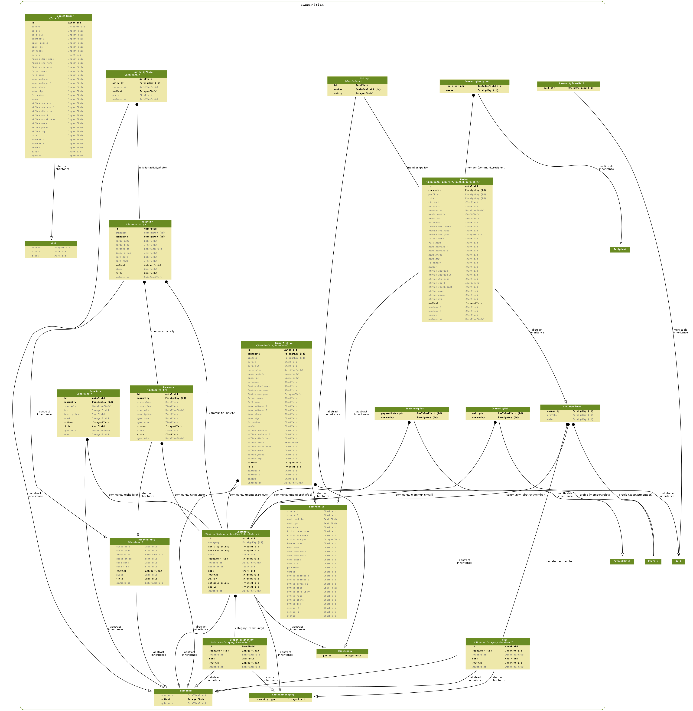

====================================
支援システム
====================================

.. contents::
    :local:

.. _communities.models.AbstractCategory:

AbstractCategory:abstract category
====================================================================

.. autoclass:: communities.models.AbstractCategory
    :members:

.. list-table::

    *    - community_type
         - コミュニティタイプ
         - integer
         - コミュニティタイプ

           .. list-table::

               *    - 0
                    - その他
           
               *    - 1
                    - 年度会
           
               *    - 2
                    - 支部会
           
               *    - 3
                    - 同好会・サークル
           
               *    - 4
                    - クラス会
           

.. include:: communities.models.AbstractCategory.rst

.. _communities.models.AbstractMember:

AbstractMember:abstract member
============================================================

.. autoclass:: communities.models.AbstractMember
    :members:

.. list-table::

    *    - community
         - 支部会/年度会
         - integer
         - 

    *    - role
         - メンバーロール
         - integer
         - 役職名

    *    - profile
         - 如水会員属性
         - integer
         - 

.. include:: communities.models.AbstractMember.rst

.. _communities.models.Activity:

Activity:活動
======================

.. autoclass:: communities.models.Activity
    :members:

.. list-table::

    *    - id
         - ID
         - integer AUTO_INCREMENT
         - 

    *    - ordinal
         - 指定並順
         - integer
         - 通常は大きい数値ほど一覧の先頭に現れます。

    *    - created_at
         - 作成日時
         - datetime
         - 

    *    - updated_at
         - 更新日時
         - datetime
         - 

    *    - title
         - 名称
         - varchar(100)
         - 名称

    *    - place
         - 場所
         - varchar(200)
         - 場所

    *    - description
         - 詳細
         - longtext
         - 詳細

    *    - open_date
         - 開始日
         - date
         - 開始日

    *    - open_time
         - 開始時刻
         - time
         - 開始時刻

    *    - close_date
         - 終了日
         - date
         - 終了日

    *    - close_time
         - 終了時刻
         - time
         - 終了時刻

    *    - community
         - 支部会/年度会
         - integer
         - 

    *    - announce
         - 活動告知
         - integer
         - 

.. include:: communities.models.Activity.rst

.. _communities.models.ActivityPhoto:

ActivityPhoto:活動報告写真
========================================

.. autoclass:: communities.models.ActivityPhoto
    :members:

.. list-table::

    *    - id
         - ID
         - integer AUTO_INCREMENT
         - 

    *    - ordinal
         - 指定並順
         - integer
         - 通常は大きい数値ほど一覧の先頭に現れます。

    *    - created_at
         - 作成日時
         - datetime
         - 

    *    - updated_at
         - 更新日時
         - datetime
         - 

    *    - activity
         - 活動報告
         - integer
         - 

    *    - photo
         - 活動報告写真
         - varchar(100)
         - 活動報告写真

.. include:: communities.models.ActivityPhoto.rst

.. _communities.models.Announce:

Announce:活動告知
==========================

.. autoclass:: communities.models.Announce
    :members:

.. list-table::

    *    - id
         - ID
         - integer AUTO_INCREMENT
         - 

    *    - ordinal
         - 指定並順
         - integer
         - 通常は大きい数値ほど一覧の先頭に現れます。

    *    - created_at
         - 作成日時
         - datetime
         - 

    *    - updated_at
         - 更新日時
         - datetime
         - 

    *    - title
         - 名称
         - varchar(100)
         - 名称

    *    - place
         - 場所
         - varchar(200)
         - 場所

    *    - description
         - 詳細
         - longtext
         - 詳細

    *    - open_date
         - 開始日
         - date
         - 開始日

    *    - open_time
         - 開始時刻
         - time
         - 開始時刻

    *    - close_date
         - 終了日
         - date
         - 終了日

    *    - close_time
         - 終了時刻
         - time
         - 終了時刻

    *    - community
         - 支部会/年度会
         - integer
         - 

.. include:: communities.models.Announce.rst

.. _communities.models.BaseActivity:

BaseActivity:base activity
====================================================

.. autoclass:: communities.models.BaseActivity
    :members:

.. list-table::

    *    - ordinal
         - 指定並順
         - integer
         - 通常は大きい数値ほど一覧の先頭に現れます。

    *    - created_at
         - 作成日時
         - datetime
         - 

    *    - updated_at
         - 更新日時
         - datetime
         - 

    *    - title
         - 名称
         - varchar(100)
         - 名称

    *    - place
         - 場所
         - varchar(200)
         - 場所

    *    - description
         - 詳細
         - longtext
         - 詳細

    *    - open_date
         - 開始日
         - date
         - 開始日

    *    - open_time
         - 開始時刻
         - time
         - 開始時刻

    *    - close_date
         - 終了日
         - date
         - 終了日

    *    - close_time
         - 終了時刻
         - time
         - 終了時刻

.. include:: communities.models.BaseActivity.rst

.. _communities.models.BasePolicy:

BasePolicy:base policy
============================================

.. autoclass:: communities.models.BasePolicy
    :members:

.. list-table::

    *    - policy
         - 公開ポリシー
         - integer
         - 公開ポリシー

           .. list-table::

               *    - 0
                    - 管理者のみ公開
           
               *    - 10
                    - メンバーのみ公開
           
               *    - 20
                    - 如水会員のみ公開
           
               *    - 100
                    - 公開
           

.. include:: communities.models.BasePolicy.rst

.. _communities.models.BaseProfile:

BaseProfile:base profile
================================================

.. autoclass:: communities.models.BaseProfile
    :members:

.. list-table::

    *    - entrance
         - 入学年・クラス
         - varchar(15)
         - 入学年・クラス

    *    - js_number
         - 如水会番号
         - varchar(12)
         - 如水会番号

    *    - number
         - 会員番号
         - varchar(15)
         - 会員番号

    *    - status
         - 会員ステータス
         - varchar(10)
         - 会員ステータス

    *    - full_name
         - 氏名
         - varchar(44)
         - 氏名

    *    - former_name
         - 旧姓
         - varchar(44)
         - 旧姓

    *    - finish_era_name
         - 卒年号
         - varchar(2)
         - 卒年号

    *    - finish_era_year
         - 卒年
         - integer
         - 卒年

    *    - finish_dept_name
         - 学部
         - varchar(2)
         - 学部

    *    - office_name
         - 勤務先名称
         - varchar(56)
         - 勤務先名称

    *    - office_division
         - 所属
         - varchar(156)
         - 所属

    *    - office_zip
         - 〒
         - varchar(10)
         - 勤務先郵便番号

    *    - office_address_1
         - 所在地1
         - varchar(50)
         - 所在地1

    *    - office_address_2
         - 所在地2
         - varchar(50)
         - 所在地2

    *    - office_phone
         - 勤務先電話番号
         - varchar(15)
         - 勤務先電話番号

    *    - office_email
         - 勤務先メールアドレス
         - varchar(100)
         - 勤務先メールアドレス

    *    - office_enrollment
         - 勤務先（在籍）
         - varchar(156)
         - 勤務先（在籍）

    *    - home_zip
         - 自宅郵便番号
         - varchar(10)
         - 自宅郵便番号

    *    - home_address_1
         - 自宅住所1
         - varchar(50)
         - 自宅住所1

    *    - home_address_2
         - 自宅住所2
         - varchar(50)
         - 自宅住所2

    *    - home_phone
         - 自宅電話
         - varchar(15)
         - 自宅電話

    *    - email_pc
         - 電子メール
         - varchar(100)
         - 電子メール

    *    - email_mobile
         - 携帯メールアドレス
         - varchar(100)
         - 電子メール

    *    - seminar_1
         - ゼミ1
         - varchar(52)
         - ゼミ1

    *    - seminar_2
         - ゼミ2
         - varchar(52)
         - ゼミ2

    *    - circle_1
         - サークル1
         - varchar(52)
         - サークル1

    *    - circle_2
         - サークル2
         - varchar(52)
         - サークル2

.. include:: communities.models.BaseProfile.rst

.. _communities.models.Community:

Community:支部会/年度会
==================================

.. autoclass:: communities.models.Community
    :members:

.. list-table::

    *    - id
         - ID
         - integer AUTO_INCREMENT
         - 

    *    - ordinal
         - 指定並順
         - integer
         - 通常は大きい数値ほど一覧の先頭に現れます。

    *    - created_at
         - 作成日時
         - datetime
         - 

    *    - updated_at
         - 更新日時
         - datetime
         - 

    *    - policy
         - 公開ポリシー
         - integer
         - 公開ポリシー

           .. list-table::

               *    - 0
                    - 管理者のみ公開
           
               *    - 10
                    - メンバーのみ公開
           
               *    - 20
                    - 如水会員のみ公開
           
               *    - 100
                    - 公開
           

    *    - community_type
         - コミュニティタイプ
         - integer
         - コミュニティタイプ

           .. list-table::

               *    - 0
                    - その他
           
               *    - 1
                    - 年度会
           
               *    - 2
                    - 支部会
           
               *    - 3
                    - 同好会・サークル
           
               *    - 4
                    - クラス会
           

    *    - category
         - コミュニティカテゴリ
         - integer
         - コミュニティカテゴリ

    *    - code
         - 支部会/年度会コード
         - varchar(10)
         - 

    *    - name
         - 支部会/年度会名
         - varchar(50)
         - 

    *    - description
         - 支部会/年度会詳細
         - longtext
         - 

    *    - status
         - 決済状態
         - integer
         - 決済状態

           .. list-table::

               *    - 0
                    - 活動中
           
               *    - 1
                    - 休止中
           
               *    - 2
                    - 無効
           

    *    - announce_policy
         - 活動予告公開ポリシー
         - integer
         - 活動予告公開ポリシー

           .. list-table::

               *    - 0
                    - 管理者のみ公開
           
               *    - 10
                    - メンバーのみ公開
           
               *    - 20
                    - 如水会員のみ公開
           
               *    - 100
                    - 公開
           

    *    - activity_policy
         - 活動公開ポリシー
         - integer
         - 活動公開ポリシー

           .. list-table::

               *    - 0
                    - 管理者のみ公開
           
               *    - 10
                    - メンバーのみ公開
           
               *    - 20
                    - 如水会員のみ公開
           
               *    - 100
                    - 公開
           

    *    - schedule_policy
         - スケジュール公開ポリシー
         - integer
         - スケジュール公開ポリシー

           .. list-table::

               *    - 0
                    - 管理者のみ公開
           
               *    - 10
                    - メンバーのみ公開
           
               *    - 20
                    - 如水会員のみ公開
           
               *    - 100
                    - 公開
           

.. include:: communities.models.Community.rst

.. _communities.models.CommunityBoardMail:

CommunityBoardMail:支部会/年度会管理者向けメール
====================================================================

.. autoclass:: communities.models.CommunityBoardMail
    :members:

.. list-table::

    *    - id
         - ID
         - integer AUTO_INCREMENT
         - 

    *    - created_at
         - 作成日時
         - datetime
         - 

    *    - updated_at
         - 更新日時
         - datetime
         - 

    *    - sender
         - メール送信者
         - integer
         - 送信者

    *    - subject
         - 表題
         - longtext
         - 表題

    *    - body
         - 本文
         - longtext
         - 本文

    *    - html
         - Mail HTML Body
         - longtext
         - Mail HTML Body Help

    *    - status
         - 状態
         - integer
         - 状態

           .. list-table::

               *    - 0
                    - 送信状態:停止
           
               *    - 10
                    - 送信状態:送信待ち
           
               *    - 20
                    - 送信状態:送信中
           
               *    - 30
                    - 送信状態:完了
           

    *    - due_at
         - 送信予定
         - datetime
         - 送信予定

    *    - sent_at
         - 送信日時
         - datetime
         - メールが送信された日時です。記録がないと送信が完了していません。

    *    - sleep_from
         - 停止時間帯:開始
         - time
         - この時間なると送信を一時停止します

    *    - sleep_to
         - 停止時間帯:終了
         - time
         - この時間から送信を再開します

    *    - name
         - メール名称
         - varchar(50)
         - メール名称

    *    - ctx
         - Context Data
         - longtext
         - Context Data Help

    *    - mail_ptr
         - mail ptr
         - integer
         - 

.. include:: communities.models.CommunityBoardMail.rst

.. _communities.models.CommunityCategory:

CommunityCategory:コミュニティカテゴリ
========================================================

.. autoclass:: communities.models.CommunityCategory
    :members:

.. list-table::

    *    - id
         - ID
         - integer AUTO_INCREMENT
         - 

    *    - ordinal
         - 指定並順
         - integer
         - 通常は大きい数値ほど一覧の先頭に現れます。

    *    - created_at
         - 作成日時
         - datetime
         - 

    *    - updated_at
         - 更新日時
         - datetime
         - 

    *    - community_type
         - コミュニティタイプ
         - integer
         - コミュニティタイプ

           .. list-table::

               *    - 0
                    - その他
           
               *    - 1
                    - 年度会
           
               *    - 2
                    - 支部会
           
               *    - 3
                    - 同好会・サークル
           
               *    - 4
                    - クラス会
           

    *    - name
         - カテゴリ名
         - varchar(50)
         - カテゴリ名

.. include:: communities.models.CommunityCategory.rst

.. _communities.models.CommunityMail:

CommunityMail:支部会/年度会メール
================================================

.. autoclass:: communities.models.CommunityMail
    :members:

.. list-table::

    *    - id
         - ID
         - integer AUTO_INCREMENT
         - 

    *    - created_at
         - 作成日時
         - datetime
         - 

    *    - updated_at
         - 更新日時
         - datetime
         - 

    *    - sender
         - メール送信者
         - integer
         - 送信者

    *    - subject
         - 表題
         - longtext
         - 表題

    *    - body
         - 本文
         - longtext
         - 本文

    *    - html
         - Mail HTML Body
         - longtext
         - Mail HTML Body Help

    *    - status
         - 状態
         - integer
         - 状態

           .. list-table::

               *    - 0
                    - 送信状態:停止
           
               *    - 10
                    - 送信状態:送信待ち
           
               *    - 20
                    - 送信状態:送信中
           
               *    - 30
                    - 送信状態:完了
           

    *    - due_at
         - 送信予定
         - datetime
         - 送信予定

    *    - sent_at
         - 送信日時
         - datetime
         - メールが送信された日時です。記録がないと送信が完了していません。

    *    - sleep_from
         - 停止時間帯:開始
         - time
         - この時間なると送信を一時停止します

    *    - sleep_to
         - 停止時間帯:終了
         - time
         - この時間から送信を再開します

    *    - name
         - メール名称
         - varchar(50)
         - メール名称

    *    - ctx
         - Context Data
         - longtext
         - Context Data Help

    *    - mail_ptr
         - mail ptr
         - integer
         - 

    *    - community
         - 支部会/年度会
         - integer
         - 

.. include:: communities.models.CommunityMail.rst

.. _communities.models.CommunityRecipient:

CommunityRecipient:支部会/年度会メール受信者
================================================================

.. autoclass:: communities.models.CommunityRecipient
    :members:

.. list-table::

    *    - id
         - ID
         - integer AUTO_INCREMENT
         - 

    *    - created_at
         - 作成日時
         - datetime
         - 

    *    - updated_at
         - 更新日時
         - datetime
         - 

    *    - mail
         - メール
         - integer
         - メール

    *    - to
         - 受信者アドレス
         - integer
         - 受信者アドレス

    *    - return_path
         - 戻りアドレス
         - varchar(50)
         - 戻りアドレス(Return_Path)。ブランクで保存すると自動的に設定されます。

    *    - sent_at
         - 送信日時記録
         - datetime
         - まだ転送されていないと指定されていません。

    *    - error_message
         - エラーメール
         - integer
         - エラーがないと指定されていません。

    *    - recipient_ptr
         - recipient ptr
         - integer
         - 

    *    - member
         - member
         - integer
         - 

.. include:: communities.models.CommunityRecipient.rst

.. _communities.models.ImportMember:

ImportMember:支部会/年度会メンバーインポート
==========================================================

.. autoclass:: communities.models.ImportMember
    :members:

.. list-table::

    *    - id
         - ID
         - integer AUTO_INCREMENT
         - 

    *    - title
         - タイトル
         - varchar(50)
         - 更新処理のタイトル

    *    - action
         - 操作
         - integer
         - データ処理

           .. list-table::

               *    - 0
                    - 未定
           
               *    - 1
                    - 更新
           
               *    - 2
                    - 追加
           
               *    - 3
                    - 削除
           
               *    - 4
                    - 何もしない
           

    *    - errors
         - エラー
         - longtext
         - Errors Help

    *    - community
         - 会名称
         - varchar(15)
         - 会名称

    *    - role
         - 役割
         - varchar(15)
         - 役割

    *    - updates
         - 更新区分
         - varchar(5)
         - 更新区分

    *    - entrance
         - 入学年・クラス
         - varchar(15)
         - 入学年・クラス

    *    - js_number
         - 如水会番号
         - varchar(15)
         - 如水会番号(原則、事務局と本人以外には非公開です)

    *    - number
         - 会員番号
         - varchar(15)
         - 会員番号

    *    - status
         - 会員区分
         - varchar(10)
         - 会員区分

    *    - full_name
         - 氏名
         - varchar(44)
         - 氏名

    *    - former_name
         - 旧姓
         - varchar(44)
         - 旧姓

    *    - finish_era_name
         - 卒年号
         - varchar(2)
         - 卒年号

    *    - finish_era_year
         - 卒年
         - varchar(4)
         - 卒年

    *    - finish_dept_name
         - 学部
         - varchar(2)
         - 学部

    *    - office_name
         - 勤務先名称
         - varchar(56)
         - 勤務先名称

    *    - office_division
         - 所属
         - varchar(156)
         - 所属

    *    - office_zip
         - 〒
         - varchar(10)
         - 〒

    *    - office_address_1
         - 所在地1
         - varchar(50)
         - 所在地1

    *    - office_address_2
         - 所在地2
         - varchar(50)
         - 所在地2

    *    - office_phone
         - 電話
         - varchar(15)
         - 電話

    *    - office_email
         - メールアドレス
         - varchar(100)
         - メールアドレス

    *    - office_enrollment
         - 勤務先（在籍）
         - varchar(156)
         - 勤務先（在籍）

    *    - home_zip
         - 自宅〒
         - varchar(10)
         - 自宅〒

    *    - home_address_1
         - 住所1
         - varchar(50)
         - 住所1

    *    - home_address_2
         - 住所2
         - varchar(50)
         - 住所2

    *    - home_phone
         - 電話
         - varchar(15)
         - 電話

    *    - email_pc
         - PCメールアドレス
         - varchar(100)
         - PCメールアドレス

    *    - email_mobile
         - 携帯メールアドレス
         - varchar(100)
         - 携帯メールアドレス

    *    - seminar_1
         - ゼミ1
         - varchar(52)
         - ゼミ1

    *    - seminar_2
         - ゼミ2
         - varchar(52)
         - ゼミ2

    *    - circle_1
         - サークル1
         - varchar(52)
         - サークル1

    *    - circle_2
         - サークル1
         - varchar(52)
         - サークル2

.. include:: communities.models.ImportMember.rst

.. _communities.models.Member:

Member:支部会/年度会メンバー
====================================

.. autoclass:: communities.models.Member
    :members:

.. list-table::

    *    - id
         - ID
         - integer AUTO_INCREMENT
         - 

    *    - ordinal
         - 指定並順
         - integer
         - 通常は大きい数値ほど一覧の先頭に現れます。

    *    - created_at
         - 作成日時
         - datetime
         - 

    *    - updated_at
         - 更新日時
         - datetime
         - 

    *    - entrance
         - 入学年・クラス
         - varchar(15)
         - 入学年・クラス

    *    - js_number
         - 如水会番号
         - varchar(12)
         - 如水会番号

    *    - number
         - 会員番号
         - varchar(15)
         - 会員番号

    *    - status
         - 会員ステータス
         - varchar(10)
         - 会員ステータス

    *    - full_name
         - 氏名
         - varchar(44)
         - 氏名

    *    - former_name
         - 旧姓
         - varchar(44)
         - 旧姓

    *    - finish_era_name
         - 卒年号
         - varchar(2)
         - 卒年号

    *    - finish_era_year
         - 卒年
         - integer
         - 卒年

    *    - finish_dept_name
         - 学部
         - varchar(2)
         - 学部

    *    - office_name
         - 勤務先名称
         - varchar(56)
         - 勤務先名称

    *    - office_division
         - 所属
         - varchar(156)
         - 所属

    *    - office_zip
         - 〒
         - varchar(10)
         - 勤務先郵便番号

    *    - office_address_1
         - 所在地1
         - varchar(50)
         - 所在地1

    *    - office_address_2
         - 所在地2
         - varchar(50)
         - 所在地2

    *    - office_phone
         - 勤務先電話番号
         - varchar(15)
         - 勤務先電話番号

    *    - office_email
         - 勤務先メールアドレス
         - varchar(100)
         - 勤務先メールアドレス

    *    - office_enrollment
         - 勤務先（在籍）
         - varchar(156)
         - 勤務先（在籍）

    *    - home_zip
         - 自宅郵便番号
         - varchar(10)
         - 自宅郵便番号

    *    - home_address_1
         - 自宅住所1
         - varchar(50)
         - 自宅住所1

    *    - home_address_2
         - 自宅住所2
         - varchar(50)
         - 自宅住所2

    *    - home_phone
         - 自宅電話
         - varchar(15)
         - 自宅電話

    *    - email_pc
         - 電子メール
         - varchar(100)
         - 電子メール

    *    - email_mobile
         - 携帯メールアドレス
         - varchar(100)
         - 電子メール

    *    - seminar_1
         - ゼミ1
         - varchar(52)
         - ゼミ1

    *    - seminar_2
         - ゼミ2
         - varchar(52)
         - ゼミ2

    *    - circle_1
         - サークル1
         - varchar(52)
         - サークル1

    *    - circle_2
         - サークル2
         - varchar(52)
         - サークル2

    *    - community
         - 支部会/年度会
         - integer
         - 

    *    - role
         - メンバーロール
         - integer
         - 役職名

    *    - profile
         - 如水会員属性
         - integer
         - 

.. include:: communities.models.Member.rst

.. _communities.models.MemberArchive:

MemberArchive:支部会/年度会 会員履歴
====================================================

.. autoclass:: communities.models.MemberArchive
    :members:

.. list-table::

    *    - id
         - ID
         - integer AUTO_INCREMENT
         - 

    *    - ordinal
         - 指定並順
         - integer
         - 通常は大きい数値ほど一覧の先頭に現れます。

    *    - created_at
         - 作成日時
         - datetime
         - 

    *    - updated_at
         - 更新日時
         - datetime
         - 

    *    - entrance
         - 入学年・クラス
         - varchar(15)
         - 入学年・クラス

    *    - js_number
         - 如水会番号
         - varchar(12)
         - 如水会番号

    *    - number
         - 会員番号
         - varchar(15)
         - 会員番号

    *    - status
         - 会員ステータス
         - varchar(10)
         - 会員ステータス

    *    - full_name
         - 氏名
         - varchar(44)
         - 氏名

    *    - former_name
         - 旧姓
         - varchar(44)
         - 旧姓

    *    - finish_era_name
         - 卒年号
         - varchar(2)
         - 卒年号

    *    - finish_era_year
         - 卒年
         - integer
         - 卒年

    *    - finish_dept_name
         - 学部
         - varchar(2)
         - 学部

    *    - office_name
         - 勤務先名称
         - varchar(56)
         - 勤務先名称

    *    - office_division
         - 所属
         - varchar(156)
         - 所属

    *    - office_zip
         - 〒
         - varchar(10)
         - 勤務先郵便番号

    *    - office_address_1
         - 所在地1
         - varchar(50)
         - 所在地1

    *    - office_address_2
         - 所在地2
         - varchar(50)
         - 所在地2

    *    - office_phone
         - 勤務先電話番号
         - varchar(15)
         - 勤務先電話番号

    *    - office_email
         - 勤務先メールアドレス
         - varchar(100)
         - 勤務先メールアドレス

    *    - office_enrollment
         - 勤務先（在籍）
         - varchar(156)
         - 勤務先（在籍）

    *    - home_zip
         - 自宅郵便番号
         - varchar(10)
         - 自宅郵便番号

    *    - home_address_1
         - 自宅住所1
         - varchar(50)
         - 自宅住所1

    *    - home_address_2
         - 自宅住所2
         - varchar(50)
         - 自宅住所2

    *    - home_phone
         - 自宅電話
         - varchar(15)
         - 自宅電話

    *    - email_pc
         - 電子メール
         - varchar(100)
         - 電子メール

    *    - email_mobile
         - 携帯メールアドレス
         - varchar(100)
         - 電子メール

    *    - seminar_1
         - ゼミ1
         - varchar(52)
         - ゼミ1

    *    - seminar_2
         - ゼミ2
         - varchar(52)
         - ゼミ2

    *    - circle_1
         - サークル1
         - varchar(52)
         - サークル1

    *    - circle_2
         - サークル2
         - varchar(52)
         - サークル2

    *    - community
         - 支部会/年度会
         - integer
         - 

    *    - role
         - メンバーロール
         - integer
         - 

    *    - profile
         - 如水会員属性
         - integer
         - 如水会員属性

.. include:: communities.models.MemberArchive.rst

.. _communities.models.MembershipFee:

MembershipFee:会費
================================

.. autoclass:: communities.models.MembershipFee
    :members:

.. list-table::

    *    - id
         - ID
         - integer AUTO_INCREMENT
         - 

    *    - created_at
         - 作成日時
         - datetime
         - 

    *    - updated_at
         - 更新日時
         - datetime
         - 

    *    - title
         - 決済名目
         - varchar(100)
         - 

    *    - description
         - 決済の内容
         - longtext
         - 

    *    - status
         - 決済状態
         - integer
         - 決済状態

           .. list-table::

               *    - 0
                    - 修正中
           
               *    - 10
                    - 確定
           
               *    - 20
                    - 決済依頼中
           
               *    - 30
                    - 完了
           

    *    - total_amount
         - 合計金額
         - numeric(15, 2)
         - 合計金額

    *    - total_payed
         - 入金合計
         - numeric(15, 2)
         - 入金合計

    *    - paymentbatch_ptr
         - paymentbatch ptr
         - integer
         - 

    *    - community
         - 支部会/年度会
         - integer
         - 

.. include:: communities.models.MembershipFee.rst

.. _communities.models.Policy:

Policy:公開ポリシー
==========================

.. autoclass:: communities.models.Policy
    :members:

.. list-table::

    *    - id
         - ID
         - integer AUTO_INCREMENT
         - 

    *    - policy
         - 公開ポリシー
         - integer
         - 公開ポリシー

           .. list-table::

               *    - 0
                    - 管理者のみ公開
           
               *    - 10
                    - メンバーのみ公開
           
               *    - 20
                    - 如水会員のみ公開
           
               *    - 100
                    - 公開
           

    *    - member
         - ポリシー
         - integer
         - ポリシー

.. include:: communities.models.Policy.rst

.. _communities.models.Role:

Role:メンバーロール
========================

.. autoclass:: communities.models.Role
    :members:

.. list-table::

    *    - id
         - ID
         - integer AUTO_INCREMENT
         - 

    *    - ordinal
         - 指定並順
         - integer
         - 通常は大きい数値ほど一覧の先頭に現れます。

    *    - created_at
         - 作成日時
         - datetime
         - 

    *    - updated_at
         - 更新日時
         - datetime
         - 

    *    - community_type
         - コミュニティタイプ
         - integer
         - コミュニティタイプ

           .. list-table::

               *    - 0
                    - その他
           
               *    - 1
                    - 年度会
           
               *    - 2
                    - 支部会
           
               *    - 3
                    - 同好会・サークル
           
               *    - 4
                    - クラス会
           

    *    - name
         - 役職名
         - varchar(20)
         - カテゴリ名

.. include:: communities.models.Role.rst

.. _communities.models.Schedule:

Schedule:スケジュール
==============================

.. autoclass:: communities.models.Schedule
    :members:

.. list-table::

    *    - id
         - ID
         - integer AUTO_INCREMENT
         - 

    *    - ordinal
         - 指定並順
         - integer
         - 通常は大きい数値ほど一覧の先頭に現れます。

    *    - created_at
         - 作成日時
         - datetime
         - 

    *    - updated_at
         - 更新日時
         - datetime
         - 

    *    - community
         - 支部会/年度会
         - integer
         - 

    *    - title
         - スケジュールタイトル
         - varchar(100)
         - スケジュールタイトル

    *    - year
         - 年
         - integer
         - 年

    *    - month
         - 月
         - integer
         - 月

    *    - day
         - 日
         - integer
         - 日

    *    - description
         - スケジュール詳細
         - longtext
         - スケジュール詳細

.. include:: communities.models.Schedule.rst

.. _communities.models.er:

ER Diagram
============================

.. _communities.models.er:

ER Diagram
============================

