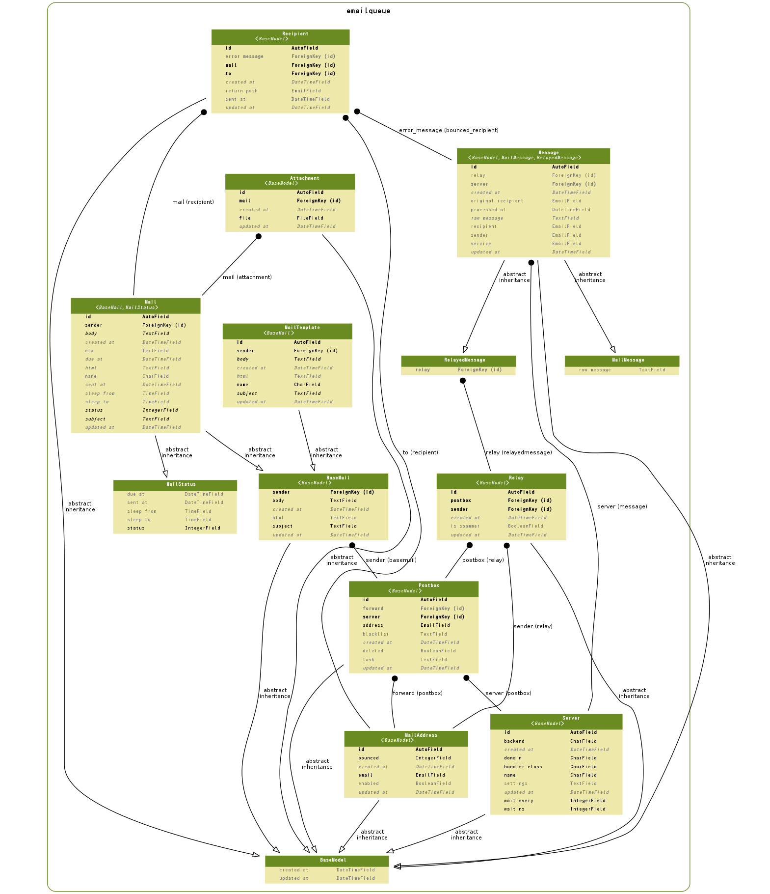

==================================================
 Email Delivery Subsystem
==================================================

.. contents::
    :local:

.. _emailqueue.models.Attachment:

Attachment:添付ファイル
==================================

.. autoclass:: emailqueue.models.Attachment
    :members:

.. list-table::

    *    - id
         - ID
         - integer AUTO_INCREMENT
         - 

    *    - created_at
         - 作成日時
         - datetime
         - 

    *    - updated_at
         - 更新日時
         - datetime
         - 

    *    - mail
         - メール
         - integer
         - メール

    *    - file
         - 添付ファイル
         - varchar(100)
         - 添付ファイル

.. include:: emailqueue.models.Attachment.rst

.. _emailqueue.models.BaseMail:

BaseMail:base mail
====================================

.. autoclass:: emailqueue.models.BaseMail
    :members:

.. list-table::

    *    - created_at
         - 作成日時
         - datetime
         - 

    *    - updated_at
         - 更新日時
         - datetime
         - 

    *    - sender
         - メール送信者
         - integer
         - 送信者

    *    - subject
         - 表題
         - longtext
         - 表題

    *    - body
         - 本文
         - longtext
         - 本文

    *    - html
         - Mail HTML Body
         - longtext
         - Mail HTML Body Help

.. include:: emailqueue.models.BaseMail.rst

.. _emailqueue.models.BaseModel:

BaseModel:base model
========================================

.. autoclass:: emailqueue.models.BaseModel
    :members:

.. list-table::

    *    - created_at
         - 作成日時
         - datetime
         - 

    *    - updated_at
         - 更新日時
         - datetime
         - 

.. include:: emailqueue.models.BaseModel.rst

.. _emailqueue.models.Mail:

Mail:メール
================

.. autoclass:: emailqueue.models.Mail
    :members:

.. list-table::

    *    - id
         - ID
         - integer AUTO_INCREMENT
         - 

    *    - created_at
         - 作成日時
         - datetime
         - 

    *    - updated_at
         - 更新日時
         - datetime
         - 

    *    - sender
         - メール送信者
         - integer
         - 送信者

    *    - subject
         - 表題
         - longtext
         - 表題

    *    - body
         - 本文
         - longtext
         - 本文

    *    - html
         - Mail HTML Body
         - longtext
         - Mail HTML Body Help

    *    - status
         - 状態
         - integer
         - 状態

           .. list-table::

               *    - 0
                    - 送信状態:停止
           
               *    - 10
                    - 送信状態:送信待ち
           
               *    - 20
                    - 送信状態:送信中
           
               *    - 30
                    - 送信状態:完了
           

    *    - due_at
         - 送信予定
         - datetime
         - 送信予定

    *    - sent_at
         - 送信日時
         - datetime
         - メールが送信された日時です。記録がないと送信が完了していません。

    *    - sleep_from
         - 停止時間帯:開始
         - time
         - この時間なると送信を一時停止します

    *    - sleep_to
         - 停止時間帯:終了
         - time
         - この時間から送信を再開します

    *    - name
         - メール名称
         - varchar(50)
         - メール名称

    *    - ctx
         - Context Data
         - longtext
         - Context Data Help

.. include:: emailqueue.models.Mail.rst

.. _emailqueue.models.MailAddress:

MailAddress:メールアドレス
======================================

.. autoclass:: emailqueue.models.MailAddress
    :members:

.. list-table::

    *    - id
         - ID
         - integer AUTO_INCREMENT
         - 

    *    - created_at
         - 作成日時
         - datetime
         - 

    *    - updated_at
         - 更新日時
         - datetime
         - 

    *    - email
         - メールアドレス
         - varchar(50)
         - メールアドレス

    *    - bounced
         - バウンス回数
         - integer
         - バウンス回数

    *    - enabled
         - 有効アドレス
         - bool
         - 有効アドレス

.. include:: emailqueue.models.MailAddress.rst

.. _emailqueue.models.MailMessage:

MailMessage:mail message
================================================

.. autoclass:: emailqueue.models.MailMessage
    :members:

.. list-table::

    *    - raw_message
         - Raw Message Text
         - longtext
         - Raw Message Text Help

.. include:: emailqueue.models.MailMessage.rst

.. _emailqueue.models.MailStatus:

MailStatus:mail status
============================================

.. autoclass:: emailqueue.models.MailStatus
    :members:

.. list-table::

    *    - status
         - 状態
         - integer
         - 状態

           .. list-table::

               *    - 0
                    - 送信状態:停止
           
               *    - 10
                    - 送信状態:送信待ち
           
               *    - 20
                    - 送信状態:送信中
           
               *    - 30
                    - 送信状態:完了
           

    *    - due_at
         - 送信予定
         - datetime
         - 送信予定

    *    - sent_at
         - 送信日時
         - datetime
         - メールが送信された日時です。記録がないと送信が完了していません。

    *    - sleep_from
         - 停止時間帯:開始
         - time
         - この時間なると送信を一時停止します

    *    - sleep_to
         - 停止時間帯:終了
         - time
         - この時間から送信を再開します

.. include:: emailqueue.models.MailStatus.rst

.. _emailqueue.models.MailTemplate:

MailTemplate:メールテンプレート
============================================

.. autoclass:: emailqueue.models.MailTemplate
    :members:

.. list-table::

    *    - id
         - ID
         - integer AUTO_INCREMENT
         - 

    *    - created_at
         - 作成日時
         - datetime
         - 

    *    - updated_at
         - 更新日時
         - datetime
         - 

    *    - sender
         - メール送信者
         - integer
         - 送信者

    *    - subject
         - 表題
         - longtext
         - 表題

    *    - body
         - 本文
         - longtext
         - 本文

    *    - html
         - Mail HTML Body
         - longtext
         - Mail HTML Body Help

    *    - name
         - メール名称
         - varchar(200)
         - メール名称

.. include:: emailqueue.models.MailTemplate.rst

.. _emailqueue.models.Message:

Message:受信メール
==========================

.. autoclass:: emailqueue.models.Message
    :members:

.. list-table::

    *    - id
         - ID
         - integer AUTO_INCREMENT
         - 

    *    - created_at
         - 作成日時
         - datetime
         - 

    *    - updated_at
         - 更新日時
         - datetime
         - 

    *    - raw_message
         - Raw Message Text
         - longtext
         - Raw Message Text Help

    *    - relay
         - Forwarding Relay
         - integer
         - 

    *    - server
         - 受信者サーバー
         - integer
         - 

    *    - service
         - サービス名
         - varchar(50)
         - メール名称

    *    - sender
         - メール送信者
         - varchar(100)
         - 送信者

    *    - recipient
         - 受信者
         - varchar(100)
         - 受信者

    *    - original_recipient
         - 受信者
         - varchar(100)
         - 受信者

    *    - processed_at
         - 処理日時
         - datetime
         - 

.. include:: emailqueue.models.Message.rst

.. _emailqueue.models.Postbox:

Postbox:メール転送
==========================

.. autoclass:: emailqueue.models.Postbox
    :members:

.. list-table::

    *    - id
         - ID
         - integer AUTO_INCREMENT
         - 

    *    - created_at
         - 作成日時
         - datetime
         - 

    *    - updated_at
         - 更新日時
         - datetime
         - 

    *    - server
         - 送信サーバー
         - integer
         - 

    *    - address
         - アドレス
         - varchar(50)
         - アドレス

    *    - forward
         - 転送先
         - integer
         - 転送先

    *    - deleted
         - 削除済み
         - bool
         - 削除済み

    *    - task
         - タスク
         - longtext
         - タスク

    *    - blacklist
         - ブラックリストパターン
         - longtext
         - ブラックリストパターン

.. include:: emailqueue.models.Postbox.rst

.. _emailqueue.models.Recipient:

Recipient:受信者
==========================

.. autoclass:: emailqueue.models.Recipient
    :members:

.. list-table::

    *    - id
         - ID
         - integer AUTO_INCREMENT
         - 

    *    - created_at
         - 作成日時
         - datetime
         - 

    *    - updated_at
         - 更新日時
         - datetime
         - 

    *    - mail
         - メール
         - integer
         - メール

    *    - to
         - 受信者アドレス
         - integer
         - 受信者アドレス

    *    - return_path
         - 戻りアドレス
         - varchar(50)
         - 戻りアドレス(Return_Path)。ブランクで保存すると自動的に設定されます。

    *    - sent_at
         - 送信日時記録
         - datetime
         - まだ転送されていないと指定されていません。

    *    - error_message
         - エラーメール
         - integer
         - エラーがないと指定されていません。

.. include:: emailqueue.models.Recipient.rst

.. _emailqueue.models.Relay:

Relay:リレー記録
======================

.. autoclass:: emailqueue.models.Relay
    :members:

.. list-table::

    *    - id
         - ID
         - integer AUTO_INCREMENT
         - 

    *    - created_at
         - 作成日時
         - datetime
         - 

    *    - updated_at
         - 更新日時
         - datetime
         - 

    *    - sender
         - 送信者
         - integer
         - 送信者

    *    - postbox
         - 受信者
         - integer
         - 受信者

    *    - is_spammer
         - スパマー
         - bool
         - 

.. include:: emailqueue.models.Relay.rst

.. _emailqueue.models.RelayedMessage:

RelayedMessage:relayed message
============================================================

.. autoclass:: emailqueue.models.RelayedMessage
    :members:

.. list-table::

    *    - relay
         - Forwarding Relay
         - integer
         - 

.. include:: emailqueue.models.RelayedMessage.rst

.. _emailqueue.models.Server:

Server:サーバー
======================

.. autoclass:: emailqueue.models.Server
    :members:

.. list-table::

    *    - id
         - ID
         - integer AUTO_INCREMENT
         - 

    *    - created_at
         - 作成日時
         - datetime
         - 

    *    - updated_at
         - 更新日時
         - datetime
         - 

    *    - name
         - サービス名称
         - varchar(50)
         - 

    *    - domain
         - ドメイン名
         - varchar(50)
         - 

    *    - backend
         - バックエンド
         - varchar(100)
         - 

    *    - handler_class
         - サービスハンドラ
         - varchar(200)
         - 

    *    - settings
         - サーバー設定
         - longtext
         - 

    *    - wait_every
         - 待ち送信回数
         - integer
         - 待ち送信回数

    *    - wait_ms
         - 待ち時間(ms)
         - integer
         - 待ち時間(ms)

.. include:: emailqueue.models.Server.rst

.. _emailqueue.models.er:

ER Diagram
============================

.. _emailqueue.models.er:

ER Diagram
============================

