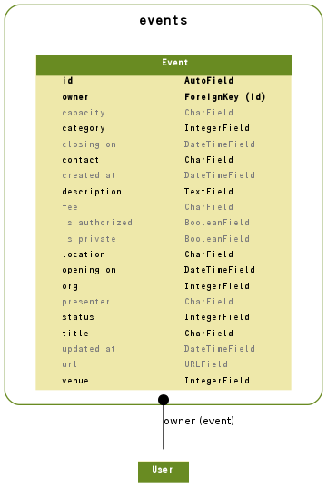

==========
Model
==========

.. contents::
    :local:

.. _events.models.Event:

Event:イベント
====================

.. autoclass:: events.models.Event
    :members:

.. list-table::

    *    - id
         - ID
         - integer AUTO_INCREMENT
         - 

    *    - owner
         - 作成者
         - integer
         - 

    *    - org
         - 組織
         - integer
         - 

           .. list-table::

               *    - 0
                    - 如水会
           
               *    - 1
                    - 大学
           
               *    - 2
                    - 研究科・研究所
           

    *    - category
         - カテゴリ
         - integer
         - 

           .. list-table::

               *    - 0
                    - イベント
           
               *    - 1
                    - ゼミ
           

    *    - title
         - 講演テーマ
         - varchar(100)
         - 

    *    - description
         - 概　要
         - longtext
         - 

    *    - presenter
         - 講　師
         - varchar(150)
         - 講師を区切り文字で登録してください

    *    - fee
         - 会費
         - varchar(150)
         - 会費はフリーフォーマットです。

    *    - capacity
         - 定員
         - varchar(10)
         - 定員はフリーフォーマットです

    *    - venue
         - 開催地
         - integer
         - 

           .. list-table::

               *    - 0
                    - 如水会館
           
               *    - 10
                    - 国立
           
               *    - 20
                    - 千代田
           
               *    - 30
                    - 小平
           
               *    - 100
                    - その他
           

    *    - location
         - 開催地詳細
         - varchar(200)
         - 

    *    - contact
         - 連絡先
         - varchar(100)
         - 

    *    - url
         - 詳細ページ
         - varchar(200)
         - 

    *    - opening_on
         - 開催日時
         - datetime
         - 

    *    - closing_on
         - 終了予定日時
         - datetime
         - 

    *    - status
         - イベント状態
         - integer
         - 

           .. list-table::

               *    - 0
                    - 未確定
           
               *    - 1
                    - 開催確定
           
               *    - 2
                    - 満員
           
               *    - 3
                    - 終了
           
               *    - 4
                    - キャンセル
           

    *    - is_private
         - 如水会員限定公開
         - bool
         - ログインした如水会員だけが見ることができます

    *    - is_authorized
         - 承認済み
         - bool
         - 

    *    - created_at
         - 作成時刻
         - datetime
         - 

    *    - updated_at
         - 更新時刻
         - datetime
         - 

.. include:: events.models.Event.rst

.. _events.models.er:

ER Diagram
============================

.. _events.models.er:

ER Diagram
============================

