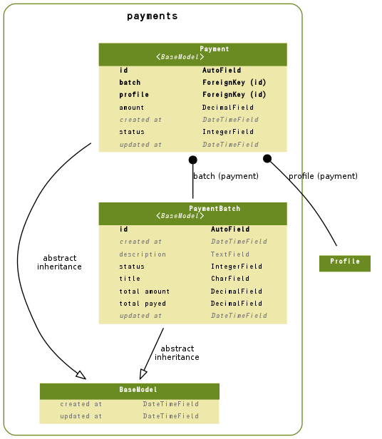

============
決済
============

.. contents::
    :local:

.. _payments.models.BaseModel:

BaseModel:base model
========================================

.. autoclass:: payments.models.BaseModel
    :members:

.. list-table::

    *    - created_at
         - 作成日時
         - datetime
         - 

    *    - updated_at
         - 更新日時
         - datetime
         - 

.. include:: payments.models.BaseModel.rst

.. _payments.models.Payment:

Payment:決済
====================

.. autoclass:: payments.models.Payment
    :members:

.. list-table::

    *    - id
         - ID
         - integer AUTO_INCREMENT
         - 

    *    - created_at
         - 作成日時
         - datetime
         - 

    *    - updated_at
         - 更新日時
         - datetime
         - 

    *    - batch
         - 決済一括依頼
         - integer
         - 

    *    - profile
         - ユーザー属性
         - integer
         - 

    *    - amount
         - 金額
         - numeric(15, 2)
         - 金額

    *    - status
         - 支払い状態
         - integer
         - 支払い状態

           .. list-table::

               *    - 0
                    - 未払い
           
               *    - 10
                    - 支払い済み
           
               *    - 20
                    - 支払い取り消し
           

.. include:: payments.models.Payment.rst

.. _payments.models.PaymentBatch:

PaymentBatch:決済一括依頼
======================================

.. autoclass:: payments.models.PaymentBatch
    :members:

.. list-table::

    *    - id
         - ID
         - integer AUTO_INCREMENT
         - 

    *    - created_at
         - 作成日時
         - datetime
         - 

    *    - updated_at
         - 更新日時
         - datetime
         - 

    *    - title
         - 決済名目
         - varchar(100)
         - 

    *    - description
         - 決済の内容
         - longtext
         - 

    *    - status
         - 決済状態
         - integer
         - 決済状態

           .. list-table::

               *    - 0
                    - 修正中
           
               *    - 10
                    - 確定
           
               *    - 20
                    - 決済依頼中
           
               *    - 30
                    - 完了
           

    *    - total_amount
         - 合計金額
         - numeric(15, 2)
         - 合計金額

    *    - total_payed
         - 入金合計
         - numeric(15, 2)
         - 入金合計

.. include:: payments.models.PaymentBatch.rst

.. _payments.models.er:

ER Diagram
============================

.. _payments.models.er:

ER Diagram
============================

